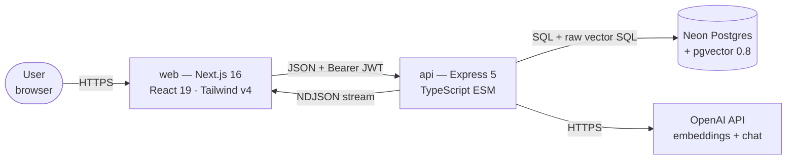
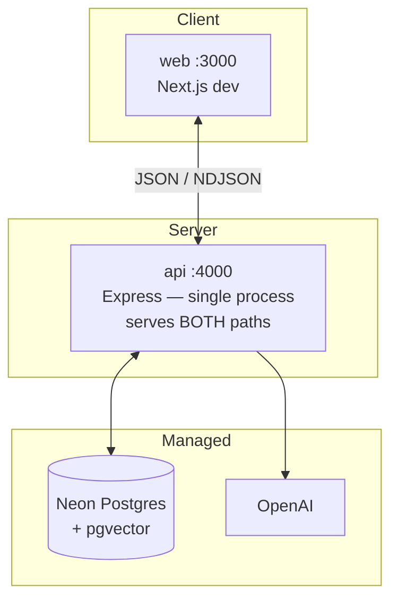
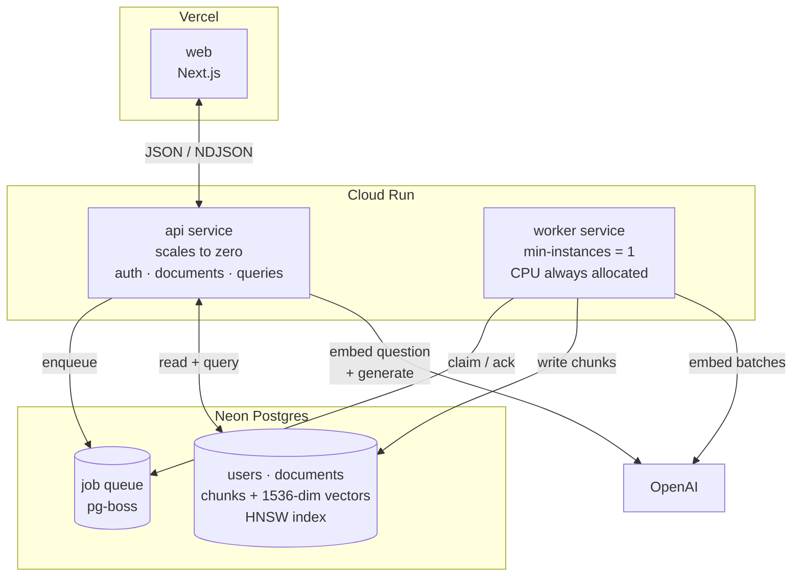

# High-Level Design — RAG Knowledge Assistant

**Scope:** system topology, data flow, capacity, failure behaviour, and the scaling ladder.
For module internals, schemas, sequence diagrams, and API contracts, see [LLD](lld.md).
For the chronological decision log, see [STATUS.md](../STATUS.md).

**Status legend used throughout:** ✅ built and verified · 🟡 built but degraded/incomplete · ⬜ designed, not built

---

## 1. Problem statement

Let a user upload their own documents and ask natural-language questions over them, returning
answers that are **grounded** (drawn only from their own text), **cited** (every claim traceable
to a specific chunk), and **refused** when the corpus doesn't contain the answer.

The hard requirement that shapes every decision below: **a confident wrong answer is worse than
no answer.** Groundedness beats coverage; a refusal is a success case, not a failure case.

### Non-goals

Deliberately out of scope, with the reasoning:

| Non-goal | Why |
|---|---|
| OCR for scanned PDFs | A scanned page is a *picture* of text. Extracting it is a different and far more expensive capability than parsing. Image-only PDFs are detected and rejected with a specific `422` rather than silently ingested as empty. |
| Multi-user document sharing | Every access-control decision in the system assumes single-owner documents. Sharing would reopen all of them at once. |
| Conversational memory / follow-up questions | Each query is independent. Multi-turn requires query rewriting, which is deferred until evals can measure whether it helps. |
| Real-time collaborative editing | Documents are immutable after ingestion. Editing means re-chunking and re-embedding — a different system. |

---

## 2. System context



**Trust boundary** sits at the `api` edge. Everything to the left of it is untrusted: the browser,
the JWT payload's *claims about identity* (verified, not trusted-as-sent), and every request body.
Everything to the right is trusted infrastructure reached over authenticated connections.

The single most important consequence: **`userId` is only ever read from a verified token**, never
from a request body. Both `createDocumentSchema` and `askSchema` deliberately omit it, so there is
no field a client could set to act as another user.

### External dependencies

| Dependency | Used for | Failure impact | Substitutable? |
|---|---|---|---|
| OpenAI embeddings (`text-embedding-3-small`) | Ingestion + query vectors | **Both paths dead.** No embedding → no write, no search. | Only with a full corpus re-embed. Vectors from different models are not comparable. |
| OpenAI chat (`CHAT_MODEL`, default `gpt-4o-mini`) | Answer generation | Read path dead; retrieval still works | Yes — env var. A model swap is a deploy decision. |
| Neon Postgres | All persistence + vector search | Total outage | In principle; pgvector is the coupling point. |

That asymmetry — **embedding model hardcoded, chat model configurable** — is the design's single
most load-bearing config decision. Changing `CHAT_MODEL` costs a deploy. Changing the embedding
model invalidates every vector in the database, so it must never be a flag anyone can flip.

---

## 3. Deployment topology

### 3.1 Current — two processes, synchronous 🟡



Ingestion and query share one process and one request lifecycle. `POST /documents` runs chunking,
embedding, and persistence **inside the HTTP request** and only responds when all of it finishes.

### 3.2 Target — the write path moves off the request 🟡→⬜



**Why a worker is a separate Cloud Run service, not a thread in `api`:** Cloud Run throttles CPU to
near zero outside an active request unless CPU-always-allocated is set. A queue consumer running
inside the API container would stall mid-job whenever traffic went quiet — jobs would appear to hang
for no reason, intermittently, and only in production. The worker therefore needs
`min-instances = 1` and always-on CPU, which means **it does not scale to zero and costs money at
idle.** That cost is the real price of the async write path, and it is the honest answer to "why
split the services?"

**Why pg-boss on the existing Postgres, not Redis/BullMQ:** no second datastore, no second
connection string, and — critically — jobs and the rows they produce commit to the same database.
The runner-up (BullMQ + Upstash Redis) is faster and has better tooling, but this system's
bottleneck is OpenAI latency, not queue throughput. Adding Redis would be infrastructure that
carries no weight.

---

## 4. The two paths, and why they differ

Every RAG system has two slow paths, and they are slow in *different ways*. Conflating them is the
most common architectural mistake in this class of app.

| | Write path — ingestion | Read path — query |
|---|---|---|
| **Trigger** | `POST /documents` (JSON) · `POST /documents/upload` (multipart PDF) | `POST /queries` |
| **Slow because** | N embedding round-trips, unbounded in N | one LLM generating tokens |
| **Cost scales with** | document length | context size + answer length |
| **Is anyone waiting?** | No — the user can navigate away | **Yes, a human, right now** |
| **Correct treatment** | **Queue it.** Return `202`, report progress via status. | **Stream it.** Commit to the response early, deliver incrementally. |
| **Retry semantics** | At-least-once, idempotent | Not retryable — the user re-asks |
| **Current state** | 🟡 synchronous — see §4.1 | ✅ streamed |

The asymmetry is the design, not an inconsistency. **Slow-and-deferrable → queue.
Slow-and-user-waiting → stream.**

### 4.1 The known gap in the write path 🟡

[`document.service.ts:113-115`](../api/src/modules/documents/document.service.ts#L113-L115) claims
the state machine exists so "the frontend never has to wait on us." That is not true today. The
`PENDING → PROCESSING` transition happens, but nothing observes it — the client is blocked inside
the same request until the whole pipeline commits. The system has the state machine's *vocabulary*
without its *behaviour*.

Three concrete consequences, all currently unhandled:

1. **Long documents hit the platform timeout.** A 200,000-character document produces ~250 chunks
   and 3 batched embedding calls. On Cloud Run's 300s request ceiling this is survivable today but
   has no headroom, and the failure is a killed request with the row left mid-flight.
2. **No retry on a transient OpenAI failure.** A single 429 while embedding fails the entire
   document. `status` becomes `FAILED` and the only recovery is the user re-uploading — which the
   `contentHash` dedupe check will then *reject as a duplicate*, because a `FAILED` row still
   satisfies `@@unique([userId, contentHash])`. This is a real dead-end, not a theoretical one.
3. **A crash strands the document.** If the process dies between the `PROCESSING` update
   ([`document.service.ts:116`](../api/src/modules/documents/document.service.ts#L116)) and the
   transaction, the row sits in `PROCESSING` forever. There is no reaper and no lease timeout.

All three are fixed by the same change, and the primitives for it already exist — see §8.

---

## 5. Data architecture

One store. There is no cache tier, no object storage, no separate vector database.

```
Neon Postgres
├── User            identity, argon2id password hash
├── Document        raw text (source of truth for re-processing), status, contentHash
├── Chunk           chunk text + vector(1536) + HNSW index
└── (target) job queue — pg-boss tables, same database
```

**Why the raw `content` is retained on `Document`** even though only chunks are ever queried:
re-chunking is a first-class operation. Settling `chunkSize` and `chunkOverlap` empirically (M7)
means re-processing the entire corpus repeatedly, and that must not require the user to re-upload
anything. This is also why a `reprocess` job type falls out of the queue work for free.

**Why uploaded files are *not* stored.** A PDF is converted to text at the edge and the bytes are
discarded — `memoryStorage`, never disk, never object storage. The system's source of truth is the
extracted text, because that is the only thing it can chunk, embed or cite. Keeping the original
would add a storage tier, a lifecycle policy and a deletion path, all to serve a file nobody ever
requests. The cost of that choice, stated honestly: **re-processing cannot recover text the parser
missed the first time** — a better parser would need the user to upload again. Acceptable while
extraction is a solved problem for text-bearing PDFs; it would not be if OCR were in scope.

**What page structure buys.** `Chunk.page` existed in the schema from the first migration and sat
unused for as long as pasted text was the only input, because a string has no pages. A PDF is the
only source that can populate it, which is what makes upload an architectural feature rather than a
convenience one: a citation moves from *"chunk 12"* — an internal ordinal a reader cannot verify —
to *"page 7"*, which they can go and check. Groundedness that cannot be checked is just a claim.

**Why no separate vector DB** (Pinecone / Qdrant / Weaviate): the corpus is joined to `Document`
on every single retrieval, both to fetch the citation title *and* to enforce the tenant scope. A
dedicated vector store would split that join across two systems and force tenant isolation into
metadata filters that no database constraint backs. Keeping vectors in Postgres means ownership
stays enforceable in a `WHERE` clause. The trade is that pgvector's ceiling is lower — see §7.

**Why the `embedding` column is `Unsupported("vector(1536)")`:** Prisma has no model of pgvector.
This one fact drives three downstream consequences documented in the LLD — the two-step write,
the raw-SQL read path, and the hand-written migration that must never be applied with
`prisma migrate dev`.

---

## 6. Cross-cutting concerns

### Authentication & authorisation ✅

| Concern | Mechanism | Where |
|---|---|---|
| Password storage | argon2id via `@node-rs/argon2` | `modules/auth/password.ts` |
| Session | JWT HS256, **1h expiry, no refresh** | `lib/jwt.ts` |
| Transport | `Authorization: Bearer <token>` | `middleware/auth.ts` |
| Route protection | Applied at the **mount point**, not per route | [`app.ts:51,61`](../api/src/app.ts#L51-L61) |
| Client storage | localStorage + in-memory context 🟡 | `web/src/lib/auth-context.tsx` |

Mounting `requireAuth` on the router rather than on individual routes means a route added later
**cannot ship unauthenticated.** That is a structural guarantee rather than a code-review
convention, and it is the same principle applied to tenant isolation below.

Two deliberate, known-weak spots: the token lives in `localStorage` (XSS-readable — httpOnly
cookies are the production-hardening step, deferred because it would force the streaming endpoint
off `fetch`+Bearer), and a 1-hour JWT with no refresh means the session simply dies. Both are
tracked as deferred hardening alongside rate limiting, helmet, and the login timing side-channel.

### Tenant isolation — the system's most sensitive invariant ✅

> **Every query that reads user data must constrain `userId` in its `WHERE` clause.**
> Never fetch-then-check.

Enforced in three places, with decreasing help from the compiler:

1. **Prisma reads** — `findFirst({ where: { id, userId } })`, never `findUnique({ id })` plus an
   `if`. The check cannot be forgotten because it *is* the query.
2. **Response codes** — a document belonging to another user returns `404`, byte-identical to
   "doesn't exist." A `403` would confirm the id is real, turning the endpoint into an oracle for
   enumerating another tenant's library.
3. **Raw SQL** ⚠️ — [`lib/retrieve.ts`](../api/src/lib/retrieve.ts) drops to `$queryRaw` because
   Prisma cannot express `ORDER BY embedding <=> $1::vector`. **The compiler stops helping here.**
   Deleting `WHERE d."userId" = ${userId}` produces no type error, breaks no test, and silently
   turns the endpoint into a full-corpus search across every user. This is why that file carries a
   comment block at the top and why it is the highest-priority target for the first automated test.

### Configuration ✅ / 🟡

Validated by zod at boot ([`lib/env.ts`](../api/src/lib/env.ts)), so a missing or malformed
variable fails immediately with a named error rather than deep inside a request.

> 🟡 **Known inconsistency:** `WEB_ORIGIN` is read directly via `process.env.WEB_ORIGIN` in
> [`app.ts:22`](../api/src/app.ts#L22) and is **not** in the zod schema. It therefore bypasses
> boot validation — a typo silently falls back to `http://localhost:3000`, which in production
> means CORS rejects the real frontend. Should be moved into `envSchema`.

### Error handling ✅

A single `HttpError` type plus one Express error middleware registered last. The streaming endpoint
needs a second mechanism, because a response has exactly one status code and it is spent at the
first byte — see the LLD's §5 for the header-deferral design.

---

## 7. Capacity & non-functional characteristics

> **Read this section carefully: it separates what is *enforced in code* from what is *estimated*.**
> The estimates exist to be replaced by measurements from the M7 eval harness. Publishing guesses
> as facts is exactly what the eval milestone exists to prevent.

### 7.1 Hard limits — enforced in code ✅

These are not estimates. Each is a constant with a rationale.

| Limit | Value | Enforced at | Why this value |
|---|---|---|---|
| Request body (JSON) | 1 MB | `express.json()` | Sits *above* the content limit so oversized input fails with a field message, not a bare 413. **Does not apply to uploads** — see the row below |
| Upload file size | 10 MB | `multer` `limits.fileSize` | The *only* bound on a multipart body. `express.json()` is content-type-gated: it sees `multipart/form-data`, calls `next()` without reading a byte, and its 1 MB limit never engages |
| Uploaded PDF pages | 200 | `lib/pdf.ts` | Page count, not byte count, drives extraction cost — a 2 MB file can hold thousands of pages, so the size cap alone bounds nothing |
| Document title | 200 chars | `createDocumentSchema` | Optional on the upload route, where it defaults to the sanitised filename |
| Document content | 200,000 chars | `createDocumentSchema` + upload route | Deliberately below the 1 MB body cap. Enforced a second time in the upload route because extracted text never passes through a body schema. **Rejected, never truncated** — a silently half-ingested document answers "not in your documents" for everything past the cut |
| Question length | 1,000 chars | `askSchema` | Far above a real question, far below the embedder's 8,191-token input cap |
| `k` (chunks retrieved) | 1–10, default 5 | `askSchema` | Feeds straight into the prompt; uncapped `k` is a way for a client to force an arbitrarily expensive request |
| Chunk size / overlap | 1,000 / 200 chars | `lib/chunk.ts` | ⚠️ **Chosen by judgement. Unvalidated.** M7 exists to settle this. |
| Embedding batch | 100 inputs/call | `lib/embed.ts` | API cap |
| Vector dimensions | 1,536 | `text-embedding-3-small` | Must match the `vector(1536)` column |
| HNSW build | `m=16, ef_construction=64` | migration SQL | pgvector defaults |
| HNSW search | `ef_search=100` | `lib/retrieve.ts` | Deliberate over-spend vs. the default 40; recall/latency dial |
| JWT lifetime | 1 hour | `lib/jwt.ts` | No refresh token — session simply expires |
| Ingest transaction | 30s timeout, 5s max wait | `document.service.ts` | Raised from Prisma's 5s default: many per-row embedding `UPDATE`s |

### 7.2 Derived capacity — arithmetic from the limits above

A maximum-size document (200,000 chars) at 1,000/200 chunking has an effective stride of 800 chars:

```
chunks per max document    ≈ 200,000 / 800          ≈ 250
embedding API calls        ≈ ceil(250 / 100)        = 3
vector storage per chunk   = 1,536 dims × 4 bytes   = 6,144 bytes
row storage per chunk      ≈ 6 KB vector + ~1 KB text + overhead ≈ 7–8 KB
storage per max document   ≈ 250 × 7.5 KB           ≈ 1.9 MB  (before the HNSW index)
```

**Neon free tier is 0.5 GB.** That is roughly **250 maximum-size documents, or ~65,000 chunks**,
*before* accounting for the HNSW index — which adds materially on top of the vector data. Storage,
not compute, is this deployment's first hard wall.

### 7.3 Latency budget — ⬜ targets, not measurements

Nothing here has been measured. These are the budget shape and the instrumentation plan.

| Stage | Budget target | Notes |
|---|---|---|
| Embed the question | < 200 ms | one OpenAI round-trip, ~10 tokens |
| ANN search | < 50 ms | at current corpus size; `ef_search=100` |
| **→ `sources` event emitted** | **< 300 ms** | the number the user actually feels |
| First generated token | < 1 s cumulative | `gpt-4o-mini` TTFT |
| Full answer | 2–5 s | scales with answer length |
| Neon cold start | **seconds** ⚠️ | free tier scales to zero; first request after idle may need a retry |

Sources are emitted **before** the first token specifically because retrieval is fast and
generation is slow — filling the screen with citations covers the part of the wait that is
perceptible.

**To measure at M7:** instrument `retrieveChunks` and the first `token` yield, report p50/p95 for
each stage separately. A single end-to-end number would hide which stage regressed.

### 7.4 Cost model — ⬜ formula given, rates to be filled in

Rates are deliberately **not** hardcoded here; they change, and a stale number in a design doc is
worse than no number. Fill from the current OpenAI pricing page and record the date checked.

```
Per query:
  embedding  ≈    10 tokens  × <embed rate>
  input      ≈ 1,400 tokens  × <chat input rate>     (k=5 × ~250 tok/chunk + ~150 tok system prompt)
  output     ≈   200 tokens  × <chat output rate>

Per max-size document ingested:
  embedding  ≈ 50,000 tokens × <embed rate>          (200k chars ÷ ~4 chars/token)
```

Two structural cost controls already in place: **dedupe before any work**, so re-uploading
identical text costs nothing, and **abort on client disconnect**
([`query.routes.ts:41-42`](../api/src/modules/queries/query.routes.ts#L41-L42)), so a closed tab
stops the meter instead of billing a full answer nobody reads.

---

## 8. Scaling ladder

What breaks first, at what scale, and what changes in response. **The trigger column is the point
of this table** — features listed as "deferred" elsewhere in the repo are deferred *until a
specific condition*, not indefinitely.

### Now — ~10 documents, ~2,500 chunks

Everything works. The HNSW index isn't even load-bearing at this size; a sequential scan would be
fast enough. Synchronous ingestion is tolerable because documents are small and traffic is one
user.

**Binding constraint:** none. This is demo scale.

### Next — ~1,000 documents, ~250,000 chunks

| Breaks | Fix | Trigger to act |
|---|---|---|
| Synchronous ingestion 🟡 | Queue + worker (§3.2) | Any document taking > 30 s, or the first `FAILED`-and-can't-retry dead-end |
| Neon free tier storage | Paid tier | ~250 max-size documents |
| Filtered-search recall | Already mitigated: `hnsw.iterative_scan = 'strict_order'` | Already done — see below |
| No retry on transient failure | Job retry with backoff | Ships with the queue |
| `listDocuments` returns everything | Cursor pagination — the signature already takes an object to allow this | ~100 documents per user |

**The filtered-search recall problem is worth understanding**, because it is invisible until it
isn't: an HNSW index knows nothing about `userId`, so Postgres walks the index in distance order
and *then* discards other tenants' rows. Ask for the top 5 and the scan may surface 40 candidates
that all belong to other users, leaving you with 2 results, or 0. The query stays **correct** —
never a leak — but it silently under-returns, and it degrades as users are added, so the emptiest
results land on the newest customers. pgvector 0.8's `iterative_scan` exists for exactly this and
is already enabled.

### Later — ~100,000 documents, ~25,000,000 chunks

| Breaks | Fix |
|---|---|
| HNSW index exceeds RAM | Partition `Chunk` by tenant; or denormalise `userId` onto `Chunk` with per-tenant partial indexes (faster, but multiplies index count by tenant count and needs a backfill) |
| Index build time | `maintenance_work_mem` tuning; build concurrently; accept degraded recall during rebuild |
| Re-embedding the corpus | Multi-day batch — **only feasible if the queue already exists** |
| Retrieval quality at recall depth | Hybrid search (BM25 + vector), then reranking — in that order |
| Single Postgres serving reads and writes | Read replica for the query path |

**Deferred until evals prove they help** — reranking, hybrid search, query rewriting. These are the
standard retrieval-quality ladder and all three are tempting to add on vibes. Adding them before
M7 means no way to tell whether they helped, hurt, or did nothing while tripling cost per query.

---

## 9. Failure modes & blast radius

| Failure | Blast radius | Current behaviour | Target |
|---|---|---|---|
| OpenAI embeddings down | **Total** — both paths | Write: doc `FAILED`, unretryable dead-end 🟡. Read: error before headers → clean 5xx ✅ | Job retry w/ backoff; read path unchanged |
| OpenAI chat down | Read path only | Retrieval succeeds, generation errors | Emit `sources`, then an in-band `error` event ✅ (already the behaviour) |
| Neon cold start | First request after idle | May fail; manual retry | Connection retry w/ backoff |
| Neon down | Total | 5xx everywhere | Unchanged — single point of failure by design |
| Process crash mid-ingest | One document | **Stranded in `PROCESSING` forever** 🟡 — no reaper | Job lease expiry returns it to the queue |
| Client disconnects mid-stream | One request | Abort propagates to OpenAI, no orphan billing ✅ | Unchanged |
| Mid-stream generation failure | One request | In-band `error` event, clean close ✅ | Unchanged |
| Malformed / oversized input | One request | zod → 400 with field details ✅ | Unchanged |
| Expired JWT | One user | 401, session dies (no refresh) 🟡 | Refresh token rotation |

The two 🟡 rows in the write path share one root cause and one fix.

---

## 10. Design decisions at HLD level

Decisions that shape the *system*. Module-level decisions live in the [LLD](lld.md); the full
chronological log with rationale is in [STATUS.md](../STATUS.md).

| Decision | Alternative rejected | Why |
|---|---|---|
| Standalone Express API, not Next.js API routes | Next.js route handlers | A real backend with its own lifecycle, deployable independently, testable without a framework |
| Postgres + pgvector, not a dedicated vector DB | Pinecone / Qdrant / Weaviate | Tenant isolation stays enforceable in a `WHERE` clause; one store, one transaction, one backup |
| NDJSON, not SSE | Server-Sent Events | `EventSource` cannot set headers. SSE would force the Bearer token into a query string — server logs, browser history, `Referer`. A constraint, not a preference. |
| Streaming read path, queued write path | Uniform treatment of both | They are slow for different reasons and have different waiters (§4) |
| pg-boss on the existing DB | BullMQ + Redis | No second datastore; jobs commit with the rows they produce |
| Separate worker service | Worker thread inside `api` | Cloud Run throttles CPU outside requests (§3.2) |
| Embedding model hardcoded, chat model in env | Both configurable | Changing the embedding model invalidates every stored vector |
| PDF parsed at the edge; pipeline stays text-only | Teach ingestion about file formats | One conversion point. `ingestDocument` never learns that PDFs exist, so every future format is a new parser rather than a new branch in the pipeline. |
| Separate `POST /documents/upload` | One route sniffing its own `Content-Type` | Two body parsers, two validation schemas, two error taxonomies. Branching on a header inside one handler couples failure modes that have nothing to do with each other; the JSON route stays byte-for-byte unchanged. |
| File type decided by magic bytes | Trusting `Content-Type` / the file extension | Both are client-supplied claims — `curl -F "file=@evil.html;type=application/pdf"` asserts whatever it likes. The leading `%PDF-` bytes are evidence. Necessary, not sufficient: the real guarantee is that pdf.js parses it and that we never store or re-serve the file. |
| Uploaded bytes discarded after extraction | Persist the original file | No storage tier, no lifecycle policy, no deletion path for a file nothing ever reads (§5) |
| Dedupe hashes extracted **text**, not file bytes | `sha256` of the upload | Re-exporting a document changes its bytes (timestamps, producer strings, compression) but not its meaning — byte-hashing would dedupe *less* than intended and re-embed identical content. Consequence accepted: two PDFs differing only in images collapse to one document, so the UI names the existing title. |
| Page-aware chunking, one page at a time | Concatenate, then map offsets back to pages | A chunk spanning a page break has no single honest page to cite, and a wrong citation is worse than a split paragraph. Known cost in §11. |
| No distance threshold on retrieval | Cutoff on similarity | Semantic search always returns *something*; a threshold is a magic number tuned by vibes. The **prompt** does the refusing — verified: an off-corpus question retrieves at similarity 0.33 and still returns the exact refusal string. |
| Fixed `REFUSAL` constant | "Say you don't know" | Left to its judgement the model writes a different apology each time, and a waffle is indistinguishable from a weak answer. A verbatim string is detectable by the UI and assertable by an eval. |
| `temperature: 0` | Any creativity | Grounded QA, not writing. Also makes M7 meaningful — under a non-deterministic model a regression is indistinguishable from noise. |

---

## 11. Roadmap

| Milestone | Contents | Status |
|---|---|---|
| M1–M6 | DB · auth · ingestion · documents UI · retrieval · streamed answers | ✅ |
| PDF upload | Multipart route · pdf.js extraction · page-aware chunking · page-level citations | ✅ |
| **M7 — evals** | Golden question set · hit-rate@k / MRR · groundedness · refusal accuracy · **per-page vs. whole-document chunking** | ➡️ **next** |
| M8 — async write path | pg-boss · worker service · retry · `202 Accepted` · reprocess job | ⬜ |
| M9 — deployment | Cloud Run × 2 · Vercel · CI | ⬜ |
| Hardening | Refresh tokens · rate limiting · helmet · httpOnly cookies · automated tests | ⬜ |

**PDF upload added a fourth number for M7 to settle, and a structural one.** Chunking each page
independently makes the page boundary a *hard* chunk boundary: `chunkOverlap` cannot bridge a
paragraph that spans two pages, and `chunkSize` acquires a second maximum that appears in no config
— the length of a page. A 300-page PDF of short pages yields ~300 tiny chunks instead of ~45
well-sized ones, and small chunks embed into vague vectors that retrieve on surface keywords rather
than meaning. The fix is a merge pass over consecutive short pages, which needs a page *range* on
`Chunk` and is therefore a schema change, not a tweak. Left unbuilt on purpose: whether it matters
depends entirely on the corpus, and hit-rate@k can answer that where judgement cannot.

**M7 before M8, deliberately.** The eval harness is smaller, already specified, and turns `k=5`,
`chunkSize=1000`, and `chunkOverlap=200` from judgement calls into measured numbers. It also
populates §7.3 and §7.4, which are the weakest parts of this document. But **design the job
boundary now** — keep `ingestDocument` callable as a plain function so the worker and the eval
harness invoke the same code, and M8 becomes "move the call site" rather than a rewrite.

Two open questions, unchanged: **the demo corpus**, and **whether to persist queries.** The second
stops being optional at M7 — answers are currently assembled server-side and discarded, and you
cannot score what you threw away.
