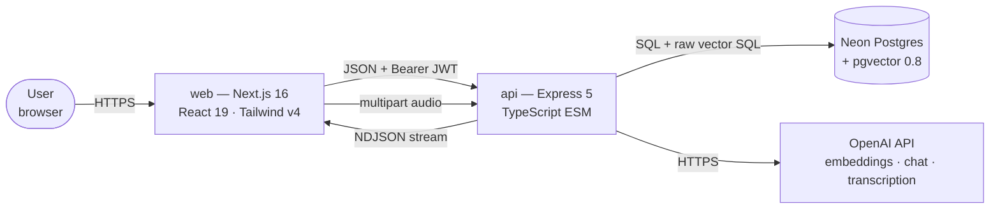
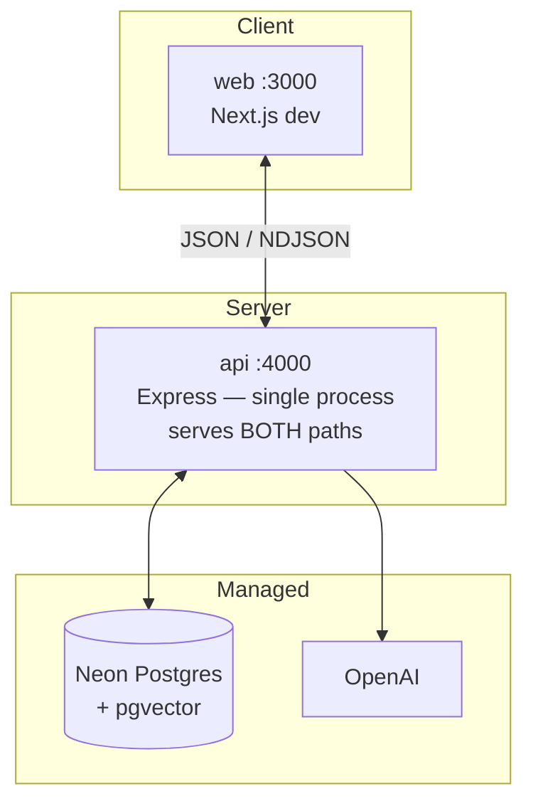
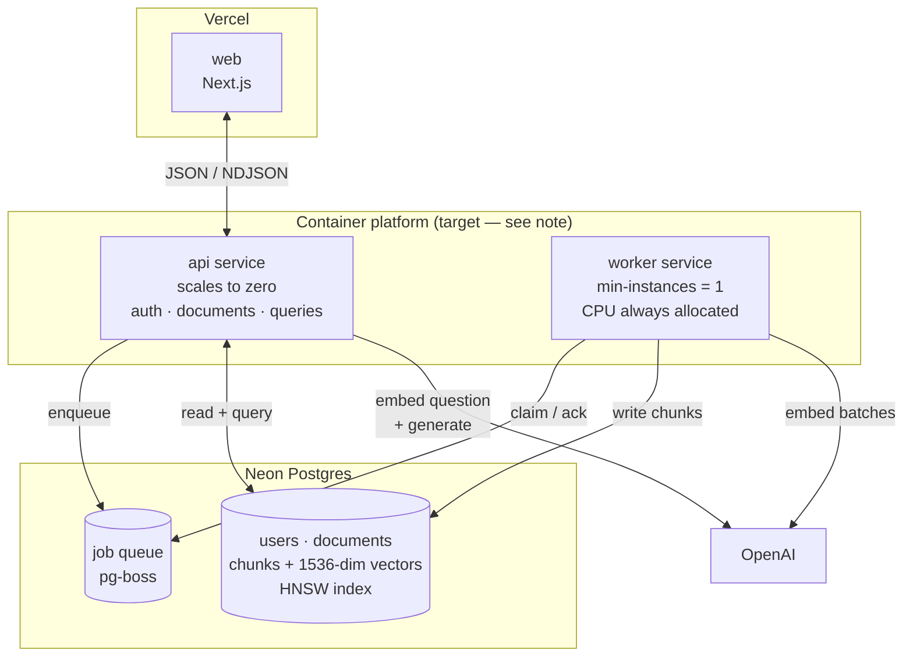

# High-Level Design — RAG Knowledge Assistant

**Scope:** system topology, data flow, capacity, failure behaviour, and the scaling ladder.
For module internals, schemas, sequence diagrams, and API contracts, see [LLD](lld.md).
For how this survived contact with a real deployment, see [deployment.md](deployment.md).

**Status legend used throughout:** ✅ built and verified · 🟡 built but degraded/incomplete · ⬜ designed, not built

---

## 1. Problem statement

Let a user upload their own documents and ask natural-language questions over them, returning
answers that are **grounded** (drawn only from their own text), **cited** (every claim traceable
to a specific chunk), and **refused** when the corpus doesn't contain the answer.

The hard requirement that shapes every decision below: **a confident wrong answer is worse than
no answer.** Groundedness beats coverage; a refusal is a success case, not a failure case.

### Non-goals

Deliberately out of scope, with the reasoning:

| Non-goal | Why |
|---|---|
| OCR for scanned PDFs | A scanned page is a *picture* of text. Extracting it is a different and far more expensive capability than parsing. Image-only PDFs are detected and rejected with a specific `422` rather than silently ingested as empty. |
| Multi-user document sharing | Every access-control decision in the system assumes single-owner documents. Sharing would reopen all of them at once. |
| Conversational memory / follow-up questions | Each query is independent. Multi-turn requires query rewriting, which is deferred until evals can measure whether it helps. |
| Real-time collaborative editing | Documents are immutable after ingestion. Editing means re-chunking and re-embedding — a different system. |

---

## 2. System context



**Speech synthesis is deliberately absent from that diagram.** Reading an answer aloud never leaves
the browser, so it is not a dependency, not a route, and not a cost. Voice *input* is all three —
see §4.2.

**Trust boundary** sits at the `api` edge. Everything to the left of it is untrusted: the browser,
the JWT payload's *claims about identity* (verified, not trusted-as-sent), and every request body.
Everything to the right is trusted infrastructure reached over authenticated connections.

The single most important consequence: **`userId` is only ever read from a verified token**, never
from a request body. `createDocumentSchema`, `askSchema` and the conversation schemas all
deliberately omit it, so there is no field a client could set to act as another user.

**Conversation history obeys the same rule, and it is worth stating separately because the
temptation is stronger.** The obvious multi-turn design has the browser post its own transcript —
it already has one on screen, and the server then holds no state. It is also the design that hands
a caller the ability to fabricate an *assistant* turn, which lands in the slot of the prompt a model
weights most heavily. History is therefore loaded server-side from `Message` rows scoped to the
caller, and `continueConversationSchema` accepts a question and nothing else. The thread id is a
path parameter rather than a body field for a smaller version of the same reason: a body that can
disagree with a path is a bug waiting to be written.

### External dependencies

| Dependency | Used for | Failure impact | Substitutable? |
|---|---|---|---|
| OpenAI embeddings (`text-embedding-3-small`) | Ingestion + query vectors | **Both paths dead.** No embedding → no write, no search. | Only with a full corpus re-embed. Vectors from different models are not comparable. |
| OpenAI chat (`CHAT_MODEL`, default `gpt-4o-mini`) | Answer generation | Read path dead; retrieval still works | Yes — env var. A model swap is a deploy decision. |
| Neon Postgres | All persistence + vector search | Total outage | In principle; pgvector is the coupling point. |
| OpenAI transcription (`gpt-4o-mini-transcribe`) | Voice input only | **Voice input dead; everything else unaffected.** The keyboard is the fallback and it is always present | Yes, but nothing depends on the choice — no stored artefact is derived from it |
| Browser `speechSynthesis` | Reading answers aloud | Feature silently unavailable; detected and the control is not rendered | Not substitutable, and not worth substituting — see §10 |

That asymmetry — **embedding model hardcoded, chat model configurable** — is the design's single
most load-bearing config decision. Changing `CHAT_MODEL` costs a deploy. Changing the embedding
model invalidates every vector in the database, so it must never be a flag anyone can flip.

The transcription model is a third case and lands with the embedder, for a different reason: it is a
constant because there is one deployment and no second transcriber to switch to, so an environment
variable would be a configuration surface with no consumer and one more thing that can be missing in
production. Note the **blast radius is the smallest of the three**: transcription touches no stored
data, so an outage costs a feature rather than a corpus.

---

## 3. Deployment topology

### 3.1 Current — two processes, synchronous 🟡



Ingestion and query share one process and one request lifecycle. `POST /documents` runs chunking,
embedding, and persistence **inside the HTTP request** and only responds when all of it finishes.

### 3.2 Target — the write path moves off the request 🟡→⬜



> **This diagram is the target, not the deployment.** As of 2026-07-27 both apps run on **Vercel**
> — `web` as a static Next.js build and `api` as a single function in `sin1` — and the worker does
> not exist yet (ingestion is still synchronous, §4.2). Redis joins the picture as the rate limiters'
> store, because a function platform scales instances and per-process counters stop meaning anything.
> See [`deployment.md`](deployment.md) for why Cloud Run was dropped and what it cost architecturally.

**Why a worker is a separate service, not a thread in `api`:** a container platform like Cloud Run
throttles CPU to near zero outside an active request unless CPU-always-allocated is set. A queue
consumer running inside the API container would stall mid-job whenever traffic went quiet — jobs
would appear to hang for no reason, intermittently, and only in production. The worker therefore
needs `min-instances = 1` and always-on CPU, which means **it does not scale to zero and costs money
at idle.** That cost is the real price of the async write path, and it is the honest answer to "why
split the services?"

**On the current function deployment the problem is sharper, not softer:** work started outside a
request doesn't merely get throttled, it is killed when the invocation returns. So M8 needs an
external queue or cron service rather than a second container — a door the Vercel deploy closed
knowingly.

**Why pg-boss on the existing Postgres, not Redis/BullMQ:** no second datastore, no second
connection string, and — critically — jobs and the rows they produce commit to the same database.
The runner-up (BullMQ + Upstash Redis) is faster and has better tooling, but this system's
bottleneck is OpenAI latency, not queue throughput. Adding Redis would be infrastructure that
carries no weight.

---

## 4. The two paths, and why they differ

Every RAG system has two slow paths, and they are slow in *different ways*. Conflating them is the
most common architectural mistake in this class of app.

| | Write path — ingestion | Read path — query |
|---|---|---|
| **Trigger** | `POST /documents` (JSON) · `POST /documents/upload` (multipart PDF) | `POST /queries` · `POST /conversations[/:id/messages]` |
| **Slow because** | N embedding round-trips, unbounded in N | one LLM generating tokens |
| **Cost scales with** | document length | context size + answer length |
| **Is anyone waiting?** | No — the user can navigate away | **Yes, a human, right now** |
| **Correct treatment** | **Queue it.** Return `202`, report progress via status. | **Stream it.** Commit to the response early, deliver incrementally. |
| **Retry semantics** | At-least-once, idempotent | Not retryable — the user re-asks |
| **Current state** | 🟡 synchronous — see §4.1 | ✅ streamed |

The asymmetry is the design, not an inconsistency. **Slow-and-deferrable → queue.
Slow-and-user-waiting → stream.**

### 4.0 Two read surfaces, one engine ✅

The read path has two entry points, and the split is deliberate rather than transitional.

| | `/queries` — single turn | `/conversations` — multi turn |
|---|---|---|
| **State** | none; nothing is persisted | `Conversation` + `Message` rows |
| **Before retrieval** | embed the question as typed | rewrite it against the thread's history first |
| **May skip retrieval** | no | yes — a reformat instruction re-grounds on the previous turn's sources |
| **Prompt** | system + one user message | system + conversation rules + recent turns + one user message |
| **Scored by the eval harness** | ✅ yes | ⬜ not yet |

They share `retrieveChunks`, `streamAnswer` and the NDJSON writer; only orchestration differs.

**Why not merge them.** The rewrite step sits *upstream of retrieval*, so folding it into `/queries`
would make hit-rate@k measure "rewrite + retrieval" while still being read as "retrieval" — and
when the graph moved there would be no way to tell which half did it. Keeping the single-turn path
byte-for-byte unchanged, down to the system prompt string, is what keeps the measurement
attributable. The multi-turn rules are *appended* to that prompt rather than edited into it, for
exactly this reason.

**What it costs.** Two surfaces answering questions about the same documents is a product question
as much as an architectural one, and the honest framing is that `/ask` is the instrumented path and
`/chat` is the product. That is defensible only for as long as it stays true.

### 4.1 The known gap in the write path 🟡

[`document.service.ts:113-115`](../api/src/modules/documents/document.service.ts#L113-L115) claims
the state machine exists so "the frontend never has to wait on us." That is not true today. The
`PENDING → PROCESSING` transition happens, but nothing observes it — the client is blocked inside
the same request until the whole pipeline commits. The system has the state machine's *vocabulary*
without its *behaviour*.

Three concrete consequences, all currently unhandled:

1. **Long documents hit the platform timeout.** A 200,000-character document produces ~250 chunks
   and 3 batched embedding calls. Against a platform request ceiling in the low hundreds of seconds
   this is survivable today but has no headroom, and the failure is a killed request with the row
   left mid-flight.
2. **No retry on a transient OpenAI failure.** A single 429 while embedding fails the entire
   document. `status` becomes `FAILED` and the only recovery is the user re-uploading — which the
   `contentHash` dedupe check will then *reject as a duplicate*, because a `FAILED` row still
   satisfies `@@unique([userId, contentHash])`. This is a real dead-end, not a theoretical one.
3. **A crash strands the document.** If the process dies between the `PROCESSING` update
   ([`document.service.ts:116`](../api/src/modules/documents/document.service.ts#L116)) and the
   transaction, the row sits in `PROCESSING` forever. There is no reaper and no lease timeout.

All three are fixed by the same change, and the primitives for it already exist — see §8.

### 4.2 Voice is an adapter around both paths, not a third one ✅

Speech is the only capability here that touches neither path, and keeping it that way is the design.

| | Voice in | Voice out |
|---|---|---|
| **Where** | `POST /transcriptions` | entirely in the browser |
| **Shape** | short, synchronous, paid | streaming, free |
| **Persists** | nothing | nothing |
| **Cost unit** | **minutes of audio** | none |
| **Failure** | a feature is unavailable; typing still works | the control is not rendered |

A recording goes up, text comes back, and the text lands in the composer. The request that
eventually reaches `/queries` or `/conversations` is **byte-identical to one a keyboard produced** —
there is no `source: "voice"` field and there should not be one, because nothing downstream has any
business behaving differently.

**Why that matters more than it looks.** Transcription sits upstream of retrieval, exactly where the
rewrite step sits (§4.0), and it has the same property: fold it in and hit-rate@k starts measuring
"transcription + retrieval" while still being read as "retrieval". The argument that kept `/queries`
untouched when chat arrived applies here before anyone has asked for it.

**The transcript is returned to the user, not forwarded.** Chaining the two requests server-side
would save a round trip and delete the only moment at which a mishearing is visible. "Parental leaf"
is a well-formed question that retrieves nothing, and the grounded prompt then correctly refuses —
so someone watches a working system deny what their document plainly says. Same failure shape as
§4.0's pronoun problem: every component behaved as designed, and the symptom is nowhere near the
cause. An editable text box converts a silent retrieval failure into an obvious typo.

**Cost is bounded in a different unit from everything else in this system.** Every other paid route
costs roughly a fixed amount per call, so counting calls bounds spend; transcription is billed by
duration, so one permitted request can cost whatever the caller makes it. The controls are therefore
layered in a specific order — the browser stops recording at 60s, the upload is byte-capped before
anything is read, and only *then* do request limits mean anything (§7.1).

### 4.3 The write path and the voice path are both multipart, and share nothing ✅

Two routes now accept `multipart/form-data` with different size caps, different accepted formats and
different downstream costs. They deliberately do not share a multer instance, a limit, or an error
message. One shared consequence had to be handled explicitly: the error middleware sees only a
`MulterError`, so a hardcoded size in a 413 would be correct for one route and a lie for the other.
The limit is resolved from the error's *field name*, which is part of each route's contract rather
than an incidental detail.

---

## 5. Data architecture

One store. There is no cache tier, no object storage, no separate vector database.

```
Neon Postgres
├── User            identity, argon2id password hash
├── Document        raw text (source of truth for re-processing), status, contentHash
├── Chunk           chunk text + vector(1536) + HNSW index
├── Conversation    a chat thread; title, updatedAt (orders the list by activity)
├── Message         role, content, seq, and a JSON snapshot of the answer's citations
└── (target) job queue — pg-boss tables, same database
```

**Why the raw `content` is retained on `Document`** even though only chunks are ever queried:
re-chunking is a first-class operation. Settling `chunkSize` and `chunkOverlap` empirically (M7)
means re-processing the entire corpus repeatedly, and that must not require the user to re-upload
anything. This is also why a `reprocess` job type falls out of the queue work for free.

**Why uploaded files are *not* stored.** A PDF is converted to text at the edge and the bytes are
discarded — `memoryStorage`, never disk, never object storage. The system's source of truth is the
extracted text, because that is the only thing it can chunk, embed or cite. Keeping the original
would add a storage tier, a lifecycle policy and a deletion path, all to serve a file nobody ever
requests. The cost of that choice, stated honestly: **re-processing cannot recover text the parser
missed the first time** — a better parser would need the user to upload again. Acceptable while
extraction is a solved problem for text-bearing PDFs; it would not be if OCR were in scope.

**What page structure buys.** `Chunk.page` existed in the schema from the first migration and sat
unused for as long as pasted text was the only input, because a string has no pages. A PDF is the
only source that can populate it, which is what makes upload an architectural feature rather than a
convenience one: a citation moves from *"chunk 12"* — an internal ordinal a reader cannot verify —
to *"page 7"*, which they can go and check. Groundedness that cannot be checked is just a claim.

**Why no separate vector DB** (Pinecone / Qdrant / Weaviate): the corpus is joined to `Document`
on every single retrieval, both to fetch the citation title *and* to enforce the tenant scope. A
dedicated vector store would split that join across two systems and force tenant isolation into
metadata filters that no database constraint backs. Keeping vectors in Postgres means ownership
stays enforceable in a `WHERE` clause. The trade is that pgvector's ceiling is lower — see §7.

**Why citations are copied onto `Message` instead of referencing `Chunk`.** The normalised design
is a join table from message to chunk, and it is wrong here. `Chunk` rows are deleted with their
document and recreated with fresh ids on every re-ingest — and §5 already commits to re-chunking as
a first-class operation, so that is the *expected* path, not an edge case. A foreign key would make
old answers silently lose their citations under `onDelete: Cascade`, or dangle under `SetNull`.

The resolution comes from asking what a citation actually asserts. It is not "this answer points at
row `abc123`"; it is **"this answer was built from this passage, at the time it was given"** — a
historical claim, and historical claims are stored as copies. So `Message.sources` holds the same
JSON the client received.

Two costs, both real and both accepted: chunk text is duplicated once per citation, and "which
passages get cited most" stops being a join and becomes a scan. At this corpus size neither
matters; at the scale in §8 the second one is the argument for a derived analytics table, not for
reverting the decision.

**Why the `embedding` column is `Unsupported("vector(1536)")`:** Prisma has no model of pgvector.
This one fact drives three downstream consequences documented in the LLD — the two-step write,
the raw-SQL read path, and the hand-written migration that must never be applied with
`prisma migrate dev`.

---

## 6. Cross-cutting concerns

### Authentication & authorisation ✅

| Concern | Mechanism | Where |
|---|---|---|
| Password storage | argon2id via `@node-rs/argon2` | `modules/auth/password.ts` |
| Session | JWT HS256, **1h expiry, no refresh** | `lib/jwt.ts` |
| Transport | `Authorization: Bearer <token>` | `middleware/auth.ts` |
| Route protection | Applied at the **mount point**, not per route | [`app.ts:51,61`](../api/src/app.ts#L51-L61) |
| Client storage | localStorage + in-memory context 🟡 | `web/src/lib/auth-context.tsx` |

Mounting `requireAuth` on the router rather than on individual routes means a route added later
**cannot ship unauthenticated.** That is a structural guarantee rather than a code-review
convention, and it is the same principle applied to tenant isolation below.

Two deliberate, known-weak spots: the token lives in `localStorage` (XSS-readable — httpOnly
cookies are the production-hardening step, deferred because it would force the streaming endpoint
off `fetch`+Bearer), and a 1-hour JWT with no refresh means the session simply dies. Both are
tracked as deferred hardening alongside rate limiting, helmet, and the login timing side-channel.

### Tenant isolation — the system's most sensitive invariant ✅

> **Every query that reads user data must constrain `userId` in its `WHERE` clause.**
> Never fetch-then-check.

Enforced in three places, with decreasing help from the compiler:

1. **Prisma reads** — `findFirst({ where: { id, userId } })`, never `findUnique({ id })` plus an
   `if`. The check cannot be forgotten because it *is* the query.
2. **Response codes** — a document belonging to another user returns `404`, byte-identical to
   "doesn't exist." A `403` would confirm the id is real, turning the endpoint into an oracle for
   enumerating another tenant's library.
3. **Raw SQL** ⚠️ — [`lib/retrieve.ts`](../api/src/lib/retrieve.ts) drops to `$queryRaw` because
   Prisma cannot express `ORDER BY embedding <=> $1::vector`. **The compiler stops helping here.**
   Deleting `WHERE d."userId" = ${userId}` produces no type error, breaks no test, and silently
   turns the endpoint into a full-corpus search across every user. This is why that file carries a
   comment block at the top and why it is the highest-priority target for the first automated test.

### Configuration ✅ / 🟡

Validated by zod at boot ([`lib/env.ts`](../api/src/lib/env.ts)), so a missing or malformed
variable fails immediately with a named error rather than deep inside a request.

> 🟡 **Known inconsistency:** `WEB_ORIGIN` is read directly via `process.env.WEB_ORIGIN` in
> [`app.ts:22`](../api/src/app.ts#L22) and is **not** in the zod schema. It therefore bypasses
> boot validation — a typo silently falls back to `http://localhost:3000`, which in production
> means CORS rejects the real frontend. Should be moved into `envSchema`.

### Error handling ✅

A single `HttpError` type plus one Express error middleware registered last. The streaming endpoint
needs a second mechanism, because a response has exactly one status code and it is spent at the
first byte — see the LLD's §5 for the header-deferral design.

---

## 7. Capacity & non-functional characteristics

> **Read this section carefully: it separates what is *enforced in code* from what is *estimated*.**
> The estimates exist to be replaced by measurements from the M7 eval harness. Publishing guesses
> as facts is exactly what the eval milestone exists to prevent.

### 7.1 Hard limits — enforced in code ✅

These are not estimates. Each is a constant with a rationale.

| Limit | Value | Enforced at | Why this value |
|---|---|---|---|
| Request body (JSON) | 1 MB | `express.json()` | Sits *above* the content limit so oversized input fails with a field message, not a bare 413. **Does not apply to uploads** — see the row below |
| Upload file size | 4 MB | `multer` `limits.fileSize` | The *only* bound on a multipart body. `express.json()` is content-type-gated: it sees `multipart/form-data`, calls `next()` without reading a byte, and its 1 MB limit never engages |
| Uploaded PDF pages | 200 | `lib/pdf.ts` | Page count, not byte count, drives extraction cost — a 2 MB file can hold thousands of pages, so the size cap alone bounds nothing |
| Audio upload size | 1 MB | `multer` `limits.fileSize` on `/transcriptions` | A **proxy for duration**, and an imperfect one: it is minutes that are billed, but nothing decodes the file before the paid call, so bytes are what can be checked for free. Roughly five minutes of the Opus every browser records — and only seconds of uncompressed WAV, which no browser produces here |
| Audio floor | 2 KB | `/transcriptions` | Below a container header plus a few frames. Bounds the *empty* case, which matters because these models hallucinate fluent text on silence — see the loudness gate below, which bounds the quiet-room case |
| Recording duration | 60 s | browser (`use-recorder.ts`) | The only bound expressed in the unit that is actually billed. Enforced on an interval rather than one timer, so a throttled background tab cannot miss it |
| Recording loudness | peak amplitude ≥ 0.02 | browser (`use-recorder.ts`) | Only the decoded samples can distinguish a quiet room from speech, and the browser is the only side that has them. Peak, not average — real speech is mostly gaps, and an averaged measure of a short question sits close to silence |
| Document title | 200 chars | `createDocumentSchema` | Optional on the upload route, where it defaults to the sanitised filename |
| Document content | 200,000 chars | `createDocumentSchema` + upload route | Deliberately below the 1 MB body cap. Enforced a second time in the upload route because extracted text never passes through a body schema. **Rejected, never truncated** — a silently half-ingested document answers "not in your documents" for everything past the cut |
| Question length | 1,000 chars | `askSchema`, conversation schemas | Far above a real question, far below the embedder's 8,191-token input cap |
| `k` (chunks retrieved) | 1–10, default 5 | `askSchema`, conversation schemas | Feeds straight into the prompt; uncapped `k` is a way for a client to force an arbitrarily expensive request |
| History window | 6 messages | `lib/condense.ts` | Three exchanges — enough to resolve "it" / "the second one", and fixed, so prompt cost does not grow with thread length |
| Assistant turn in history | 500 chars | `lib/condense.ts` | The rewriter needs to know what "that" referred to, not the whole essay. Untruncated answers are by far the largest thing that would enter this prompt |
| Rewrite output | 100 tokens generated, 400 chars accepted | `lib/condense.ts` | A rewritten question is a question. Anything longer means the model started *answering* — a known small-model failure on rewrite tasks — so the output is discarded and the raw question used |
| Conversation title | 80 chars | `conversation.schema.ts` | Derived from the first question, never client-supplied and never model-generated |
| Chunk size / overlap | 1,000 / 200 chars | `lib/chunk.ts` | ⚠️ **Chosen by judgement. Unvalidated.** M7 exists to settle this. |
| Embedding batch | 100 inputs/call | `lib/embed.ts` | API cap |
| Vector dimensions | 1,536 | `text-embedding-3-small` | Must match the `vector(1536)` column |
| HNSW build | `m=16, ef_construction=64` | migration SQL | pgvector defaults |
| HNSW search | `ef_search=100` | `lib/retrieve.ts` | Deliberate over-spend vs. the default 40; recall/latency dial |
| JWT lifetime | 1 hour | `lib/jwt.ts` | No refresh token — session simply expires |
| Ingest transaction | 30s timeout, 5s max wait | `document.service.ts` | Raised from Prisma's 5s default: many per-row embedding `UPDATE`s |

### 7.2 Derived capacity — arithmetic from the limits above

A maximum-size document (200,000 chars) at 1,000/200 chunking has an effective stride of 800 chars:

```
chunks per max document    ≈ 200,000 / 800          ≈ 250
embedding API calls        ≈ ceil(250 / 100)        = 3
vector storage per chunk   = 1,536 dims × 4 bytes   = 6,144 bytes
row storage per chunk      ≈ 6 KB vector + ~1 KB text + overhead ≈ 7–8 KB
storage per max document   ≈ 250 × 7.5 KB           ≈ 1.9 MB  (before the HNSW index)
```

**Neon free tier is 0.5 GB.** That is roughly **250 maximum-size documents, or ~65,000 chunks**,
*before* accounting for the HNSW index — which adds materially on top of the vector data. Storage,
not compute, is this deployment's first hard wall.

### 7.3 Latency budget — ⬜ targets, not measurements

Nothing here has been measured. These are the budget shape and the instrumentation plan.

| Stage | Budget target | Notes |
|---|---|---|
| Embed the question | < 200 ms | one OpenAI round-trip, ~10 tokens |
| ANN search | < 50 ms | at current corpus size; `ef_search=100` |
| **→ `sources` event emitted** | **< 300 ms** | the number the user actually feels |
| First generated token | < 1 s cumulative | `gpt-4o-mini` TTFT |
| Full answer | 2–5 s | scales with answer length |
| Neon cold start | **seconds** ⚠️ | free tier scales to zero; first request after idle may need a retry |

Sources are emitted **before** the first token specifically because retrieval is fast and
generation is slow — filling the screen with citations covers the part of the wait that is
perceptible.

**To measure at M7:** instrument `retrieveChunks` and the first `token` yield, report p50/p95 for
each stage separately. A single end-to-end number would hide which stage regressed.

### 7.4 Cost model — ⬜ formula given, rates to be filled in

Rates are deliberately **not** hardcoded here; they change, and a stale number in a design doc is
worse than no number. Fill from the current OpenAI pricing page and record the date checked.

```
Per query:
  embedding  ≈    10 tokens  × <embed rate>
  input      ≈ 1,400 tokens  × <chat input rate>     (k=5 × ~250 tok/chunk + ~150 tok system prompt)
  output     ≈   200 tokens  × <chat output rate>

Per max-size document ingested:
  embedding  ≈ 50,000 tokens × <embed rate>          (200k chars ÷ ~4 chars/token)
```

Two structural cost controls already in place: **dedupe before any work**, so re-uploading
identical text costs nothing, and **abort on client disconnect**
([`query.routes.ts:41-42`](../api/src/modules/queries/query.routes.ts#L41-L42)), so a closed tab
stops the meter instead of billing a full answer nobody reads.

---

## 8. Scaling ladder

What breaks first, at what scale, and what changes in response. **The trigger column is the point
of this table** — features listed as "deferred" elsewhere in the repo are deferred *until a
specific condition*, not indefinitely.

### Now — ~10 documents, ~2,500 chunks

Everything works. The HNSW index isn't even load-bearing at this size; a sequential scan would be
fast enough. Synchronous ingestion is tolerable because documents are small and traffic is one
user.

**Binding constraint:** none. This is demo scale.

### Next — ~1,000 documents, ~250,000 chunks

| Breaks | Fix | Trigger to act |
|---|---|---|
| Synchronous ingestion 🟡 | Queue + worker (§3.2) | Any document taking > 30 s, or the first `FAILED`-and-can't-retry dead-end |
| Neon free tier storage | Paid tier | ~250 max-size documents |
| Filtered-search recall | Already mitigated: `hnsw.iterative_scan = 'strict_order'` | Already done — see below |
| No retry on transient failure | Job retry with backoff | Ships with the queue |
| `listDocuments` returns everything | Cursor pagination — the signature already takes an object to allow this | ~100 documents per user |

**The filtered-search recall problem is worth understanding**, because it is invisible until it
isn't: an HNSW index knows nothing about `userId`, so Postgres walks the index in distance order
and *then* discards other tenants' rows. Ask for the top 5 and the scan may surface 40 candidates
that all belong to other users, leaving you with 2 results, or 0. The query stays **correct** —
never a leak — but it silently under-returns, and it degrades as users are added, so the emptiest
results land on the newest customers. pgvector 0.8's `iterative_scan` exists for exactly this and
is already enabled.

### Later — ~100,000 documents, ~25,000,000 chunks

| Breaks | Fix |
|---|---|
| HNSW index exceeds RAM | Partition `Chunk` by tenant; or denormalise `userId` onto `Chunk` with per-tenant partial indexes (faster, but multiplies index count by tenant count and needs a backfill) |
| Index build time | `maintenance_work_mem` tuning; build concurrently; accept degraded recall during rebuild |
| Re-embedding the corpus | Multi-day batch — **only feasible if the queue already exists** |
| Retrieval quality at recall depth | Hybrid search (BM25 + vector), then reranking — in that order |
| Single Postgres serving reads and writes | Read replica for the query path |

**Deferred until evals prove they help** — reranking, hybrid search, query rewriting. These are the
standard retrieval-quality ladder and all three are tempting to add on vibes. Adding them before
M7 means no way to tell whether they helped, hurt, or did nothing while tripling cost per query.

---

## 9. Failure modes & blast radius

| Failure | Blast radius | Current behaviour | Target |
|---|---|---|---|
| OpenAI embeddings down | **Total** — both paths | Write: doc `FAILED`, unretryable dead-end 🟡. Read: error before headers → clean 5xx ✅ | Job retry w/ backoff; read path unchanged |
| OpenAI chat down | Read path only | Retrieval succeeds, generation errors | Emit `sources`, then an in-band `error` event ✅ (already the behaviour) |
| Neon cold start | First request after idle | May fail; manual retry | Connection retry w/ backoff |
| Neon down | Total | 5xx everywhere | Unchanged — single point of failure by design |
| Process crash mid-ingest | One document | **Stranded in `PROCESSING` forever** 🟡 — no reaper | Job lease expiry returns it to the queue |
| Client disconnects mid-stream | One request | Abort propagates to OpenAI, no orphan billing ✅ | Unchanged |
| Mid-stream generation failure | One request | In-band `error` event, clean close ✅ | Unchanged |
| Malformed / oversized input | One request | zod → 400 with field details ✅ | Unchanged |
| Expired JWT | One user | 401, session dies (no refresh) 🟡 | Refresh token rotation |

The two 🟡 rows in the write path share one root cause and one fix.

---

## 10. Design decisions at HLD level

Decisions that shape the *system*. Module-level decisions live in the [LLD](lld.md); each decision
is also written into the code it governs, next to the thing it explains.

| Decision | Alternative rejected | Why |
|---|---|---|
| Standalone Express API, not Next.js API routes | Next.js route handlers | A real backend with its own lifecycle, deployable independently, testable without a framework |
| Postgres + pgvector, not a dedicated vector DB | Pinecone / Qdrant / Weaviate | Tenant isolation stays enforceable in a `WHERE` clause; one store, one transaction, one backup |
| NDJSON, not SSE | Server-Sent Events | `EventSource` cannot set headers. SSE would force the Bearer token into a query string — server logs, browser history, `Referer`. A constraint, not a preference. |
| Streaming read path, queued write path | Uniform treatment of both | They are slow for different reasons and have different waiters (§4) |
| pg-boss on the existing DB | BullMQ + Redis | No second datastore; jobs commit with the rows they produce |
| Separate worker service | Worker thread inside `api` | Compute platforms throttle or kill work started outside a request (§3.2) |
| Embedding model hardcoded, chat model in env | Both configurable | Changing the embedding model invalidates every stored vector |
| PDF parsed at the edge; pipeline stays text-only | Teach ingestion about file formats | One conversion point. `ingestDocument` never learns that PDFs exist, so every future format is a new parser rather than a new branch in the pipeline. |
| Separate `POST /documents/upload` | One route sniffing its own `Content-Type` | Two body parsers, two validation schemas, two error taxonomies. Branching on a header inside one handler couples failure modes that have nothing to do with each other; the JSON route stays byte-for-byte unchanged. |
| File type decided by magic bytes | Trusting `Content-Type` / the file extension | Both are client-supplied claims — `curl -F "file=@evil.html;type=application/pdf"` asserts whatever it likes. The leading `%PDF-` bytes are evidence. Necessary, not sufficient: the real guarantee is that pdf.js parses it and that we never store or re-serve the file. |
| Uploaded bytes discarded after extraction | Persist the original file | No storage tier, no lifecycle policy, no deletion path for a file nothing ever reads (§5) |
| Dedupe hashes extracted **text**, not file bytes | `sha256` of the upload | Re-exporting a document changes its bytes (timestamps, producer strings, compression) but not its meaning — byte-hashing would dedupe *less* than intended and re-embed identical content. Consequence accepted: two PDFs differing only in images collapse to one document, so the UI names the existing title. |
| Page-aware chunking, one page at a time | Concatenate, then map offsets back to pages | A chunk spanning a page break has no single honest page to cite, and a wrong citation is worse than a split paragraph. Known cost in §11. |
| No distance threshold on retrieval | Cutoff on similarity | Semantic search always returns *something*; a threshold is a magic number tuned by vibes. The **prompt** does the refusing — verified: an off-corpus question retrieves at similarity 0.33 and still returns the exact refusal string. |
| Fixed `REFUSAL` constant | "Say you don't know" | Left to its judgement the model writes a different apology each time, and a waffle is indistinguishable from a weak answer. A verbatim string is detectable by the UI and assertable by an eval. |
| `temperature: 0` | Any creativity | Grounded QA, not writing. Also makes M7 meaningful — under a non-deterministic model a regression is indistinguishable from noise. |
| Chat as a sibling module, `/queries` untouched | Teach `/queries` about history | The rewrite step sits upstream of retrieval, so merging them makes hit-rate@k measure two things at once and attribute a regression to neither (§4.0). |
| History persisted server-side | Client posts its own transcript | A client-supplied transcript can fabricate an *assistant* turn — the slot the model trusts most. Same rule as `userId` (§2). |
| Citations snapshotted onto `Message` | Foreign key to `Chunk` | Chunks are recreated on every re-ingest; a reference makes old citations vanish or dangle. A citation is a claim about the past (§5). |
| Rewrite drives *retrieval*; the original question drives *generation* | Answer the rewritten query | "Make that shorter" is nonsense as a search query and perfectly clear as an instruction. Answering the rewrite re-answers a question nobody asked. |
| A `NO_SEARCH` sentinel for reformat instructions | Always retrieve | Searching for "make it shorter" returns the corpus's least relevant chunks and the grounded prompt then correctly refuses — a correct system producing a broken-looking product. |
| Every rewrite failure falls back to the raw question | Fail the request | Condensing is a quality improvement; without it the behaviour is exactly what the app did before chat existed. Degrading to "search for what the user typed" is always safe. |
| One shared concurrency counter across both answer routes | One `limitConcurrent(2)` per mount | The counter is closed over per call, so three instances of "max 2" is a max of 6. The resource being protected is shared, so the counter must be. |
| `seq` on `Message`, not `createdAt` ordering | Order by timestamp | A question and its answer are frequently written in the same millisecond, and a timestamp gives them no defined order — rendering the answer above the question. The unique index then also serialises two tabs appending to one thread. |
| Voice as an adapter; `/queries` and `/conversations` untouched | One endpoint taking audio and returning audio | Fewer moving parts, and it makes retrieval quality measure transcription and retrieval together while still reading as retrieval (§4.2). Same argument as chat, applied pre-emptively. |
| Transcript returned to the user, not forwarded to retrieval | Chain recording straight to asking | Saves a round trip and deletes the only point at which a mishearing is visible. A misheard word is a well-formed question that retrieves nothing and is then correctly refused — a correct system producing a broken product. |
| Paid model for input, browser synthesis for output | Paid TTS for both; browser speech recognition for both | A wrong transcript changes *which passages are retrieved*; a synthetic voice reading a correct answer is still correct. Spend where an error changes the result. The output half consequently adds no route, no limiter and no cost to a public link. Browser `SpeechRecognition` was rejected for input: Firefox does not ship it, Chrome's implementation ships audio to Google, and the model is not ours to choose. |
| Audio identified by magic bytes, and the **server** names the file | Trust the client's `Content-Type` and filename | Same evidence-vs-claim rule as PDFs, plus a second job unique to audio: OpenAI selects its demuxer from the filename extension, and browsers disagree about what they record (Chrome WebM, Safari MP4). A Safari recording mislabelled `.webm` would fail inside the paid call for something knowable for free. |
| Recordings never persisted | A `Recording` table for replay or eval | Storing voice recordings of strangers who clicked a link is a data liability with no feature behind it. The eval comparison that would justify it (transcribed vs. typed hit-rate) needs a fixture set, not production audio. |
| Separate rate limiters for transcription | Reuse the answer limiters | Wrong in both directions at once: a spent question budget would silently disable the microphone, and a caller who never submits a question could transcribe all day against a counter nothing else decrements. |
| Concurrency guard **not** applied to `/transcriptions` | Apply it uniformly to every paid route | It exists to bound simultaneous *streams* holding a resource open for seconds. A short request/response would only compete for slots with the answers it is trying to ask for. |
| Realtime speech-to-speech rejected, not deferred | OpenAI Realtime over WebRTC | Functions hold no long-lived sockets, so retrieval would be called back into from inside the model's session — the grounded prompt, the fixed refusal and `temperature: 0` stop being what produces the answer. One session is also a single request that bills per minute for as long as a tab is open, which no request count bounds. And citations do not survive being spoken. |

---

## 11. Roadmap

| Milestone | Contents | Status |
|---|---|---|
| M1–M6 | DB · auth · ingestion · documents UI · retrieval · streamed answers | ✅ |
| PDF upload | Multipart route · pdf.js extraction · page-aware chunking · page-level citations | ✅ |
| **M7 — evals** | Test runner + unit/HTTP tier ✅ · reproducible corpus ✅ · golden question set ⬜ · hit-rate@k / MRR ⬜ · groundedness ⬜ · refusal accuracy ⬜ · **per-page vs. whole-document chunking** 🟡 measured, not yet scored · **rewrite quality** ⬜ new, see M10 | 🟡 **in progress** |
| M8 — async write path | pg-boss · worker service · retry · `202 Accepted` · reprocess job | ⬜ |
| M9 — deployment | **Vercel × 2** (web + API as a function), custom subdomains, Redis-backed limits | ✅ **2026-07-27** |
| M10 — conversations | `Conversation`/`Message` · history-aware rewrite · `NO_SEARCH` re-use path · `/chat` thread UI · per-message citation snapshots | ✅ **2026-08-06**, unit-tested ⬜ |
| M11 — voice | `POST /transcriptions` · magic-byte container sniffing · audio-specific limiters · browser recorder with duration and loudness gates · spoken projection of the answer · sentence-buffered `speechSynthesis` · both surfaces | ✅ **2026-08-07**. Route validation and sniffing tested ✅ · spoken projection untested ⬜ (no runner in `web`) · unevaluated ⬜ |
| Hardening | ~~Rate limiting~~ ✅ (Redis-backed) · ~~automated tests~~ ✅ (unit + HTTP tier) · refresh tokens · helmet · httpOnly cookies | 🟡 partial |

**M9 landed before M7, and not on the planned infrastructure.** Cloud Run was dropped rather than
postponed: its always-free tier covers US regions only while the database sits in `ap-southeast-1`,
so every retrieval round trip would pay a trans-Pacific cost or the tier would be abandoned.
Deploying to functions instead invalidated the single-instance assumption the cost controls were
designed around, which is what moved the rate limiters onto Redis (`REDIS_URL` is now required at
boot in production). The concurrency guard stayed in-memory deliberately — see
[`concepts.md` §1.11](concepts.md#111-rate-limiting-and-concurrency--two-different-problems).

**PDF upload added a fourth number for M7 to settle, and a structural one.** Chunking each page
independently makes the page boundary a *hard* chunk boundary: `chunkOverlap` cannot bridge a
paragraph that spans two pages, and `chunkSize` acquires a second maximum that appears in no config
— the length of a page. The fix is a merge pass over consecutive short pages, which needs a page
*range* on `Chunk` and is therefore a schema change, not a tweak.

**The effect is no longer hypothetical.** The eval corpus renders each source document at two page
densities, which holds the text constant and varies only how much of it lands on a page. At the
dense rendering the split behaves normally — the median chunk sits just under the configured ceiling
and almost nothing falls below 300 characters. At the sparse rendering it collapses: **the
chars-per-page and chars-per-chunk distributions come out identical**, meaning every page produced
exactly one chunk and `chunkSize: 1000` was never consulted. The median chunk then lands well under
half the configured size and a substantial minority fall below 300 characters.

That is the mechanism, reproduced on demand rather than argued for — and it has now survived three
documentation passes that rewrote large parts of the source text, which is worth more than the
original measurement. It is a property of the rendering, not of that week's prose.

> Exact counts are deliberately absent. **This document is one of the corpus sources**, so any figure
> printed here alters the measurement it reports — editing this paragraph moves the sparse rendering
> by a page or two. `pnpm eval:inspect` prints the current numbers; the *shape* above is what's
> stable.
>
> **Earlier revisions of this paragraph broke that rule while stating it**, quoting a median and a
> percentage that were stale by the following commit. The structural claims — pages equal chunks,
> the distributions match at every quantile, the configured size is never consulted — have held
> through every rebuild. The quantitative ones never survived one.

What is still *not* measured is whether it costs anything that matters: vague vectors are a
plausible story about retrieval, not evidence about it. Running the identical golden set against
each rendering makes page density the only variable that moved, so the hit-rate delta is
attributable. The merge pass stays unbuilt until that number exists.

**M7 before M8, deliberately.** The eval harness is smaller, already specified, and turns `k=5`,
`chunkSize=1000`, and `chunkOverlap=200` from judgement calls into measured numbers. It also
populates §7.3 and §7.4, which are the weakest parts of this document. But **design the job
boundary now** — keep `ingestDocument` callable as a plain function so the worker and the eval
harness invoke the same code, and M8 becomes "move the call site" rather than a rewrite.

**The demo-corpus question is settled; the query-persistence one is not, and it turned out not to
block M7.** The corpus is this repo's own documentation, chosen because contamination — not size —
is what invalidates a RAG eval: a model that already knows the answer produces a correct-looking
response whether retrieval worked or not, so hit-rate, groundedness and refusal accuracy all stop
measuring the system. Text written for this repo cannot be in any training set.

An earlier draft of this section claimed query persistence "stops being optional at M7 — you cannot
score what you threw away." That was wrong, and the reasoning is worth keeping: the harness calls
`answerQuestion` directly and collects the generator, so the answer never has to survive a request
to be scored. Persistence buys history, caching and dollar metering. It buys evals nothing.

**M10 landed before M7 finished, and it added work to M7 rather than removing any.** Conversations
needed persistence for history, which settled the open question above from the product side rather
than the measurement side — the note stands: it was never an eval prerequisite.

What M10 *did* change is the scope of what has to be measured. The rewrite step is a new component
sitting upstream of retrieval, with its own failure mode: a rewrite that loses the user's intent
produces confident retrieval of the wrong passage, which looks exactly like a retrieval regression.
The single-turn golden set is unaffected — `/queries` is untouched and turn one skips the rewriter
entirely — but the rewriter itself is unevaluated. The measurement that justifies it is hit-rate@k
on the rewritten query versus hit-rate@k on the raw follow-up, over a small set of multi-turn cases;
that delta is the entire argument for the extra call and the extra latency, and it does not exist
yet.

The ordering was a judgement call and worth naming as one. Building the feature first means the
harness must now separate two things that were one thing when it was specified. Building the harness
first would have delayed a feature that makes the app demonstrable. Neither is free; the cost of the
choice made is that **no claim about chat quality is currently backed by a number**, and the README
says so.

**M11 repeated the ordering choice and made the containment explicit rather than accidental.** Voice
adds a second component upstream of retrieval, and unlike the rewriter it is upstream of *everything*
— a mishearing produces a well-formed question with nothing anywhere to mark it as a bad input.

The difference from M10 is that the containment was designed in from the start. Because a transcript
enters the composer rather than the pipeline, the request reaching `/queries` is indistinguishable
from a typed one, and **the existing single-turn measurements stay valid without a special case**.
That is containment, not measurement: it stops voice contaminating the numbers, and it measures
nothing about voice. The comparison that would settle it is hit-rate@k on transcribed questions
against the same measure on their typed originals, over a fixture set of recordings — which is also
the only thing that would justify persisting audio, and the reason nothing is persisted today.

M11 also **widened an existing gap rather than opening a new one**. The spoken projection of an
answer — stripping citation markers and formatting, then buffering a token stream into whole
sentences — is pure, deterministic, and exactly the sort of logic the unit tier exists for. It is
untested, because `web` still has no test runner, which is the same gap that already leaves the
citation parser uncovered. It was checked by driving a simulated token stream through it, and that
check found a real defect: the sentence segmenter breaks after abbreviations like "e.g.", producing a
pause mid-sentence. Fixed, and worth recording that a fix proven by a throwaway script is a weaker
claim than one proven by a suite that runs on every commit.
