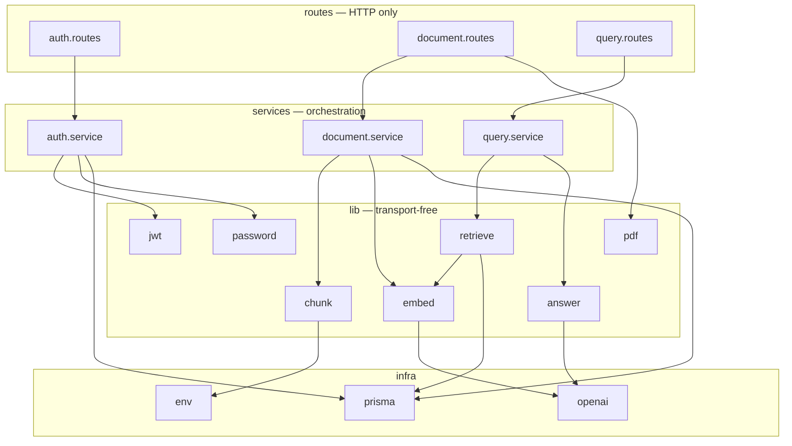
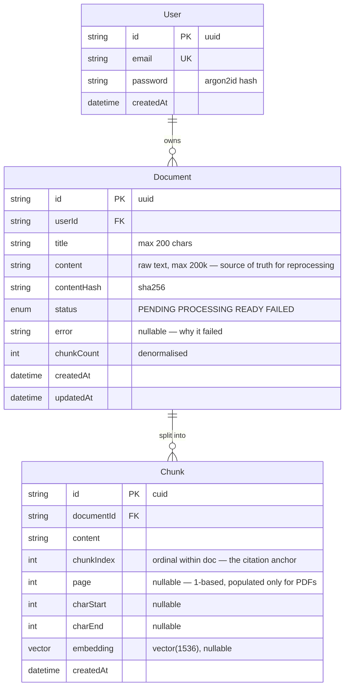
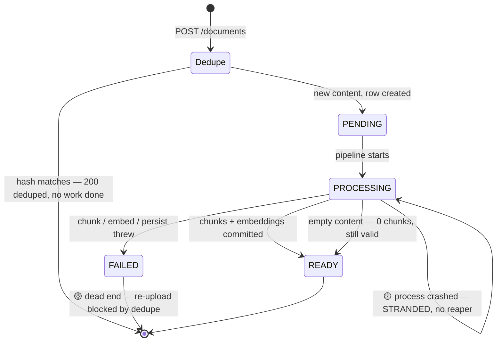
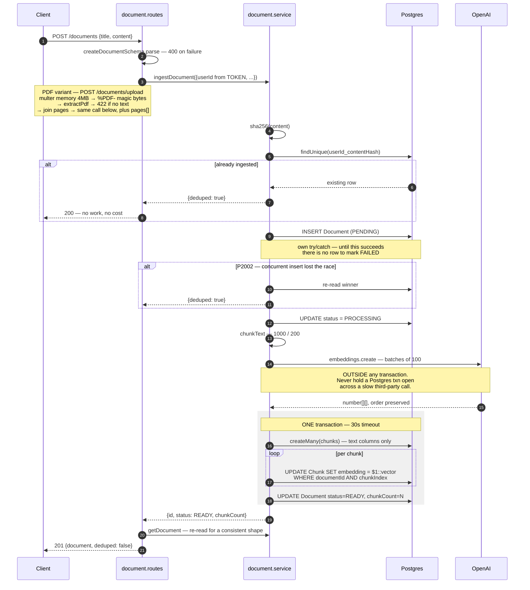
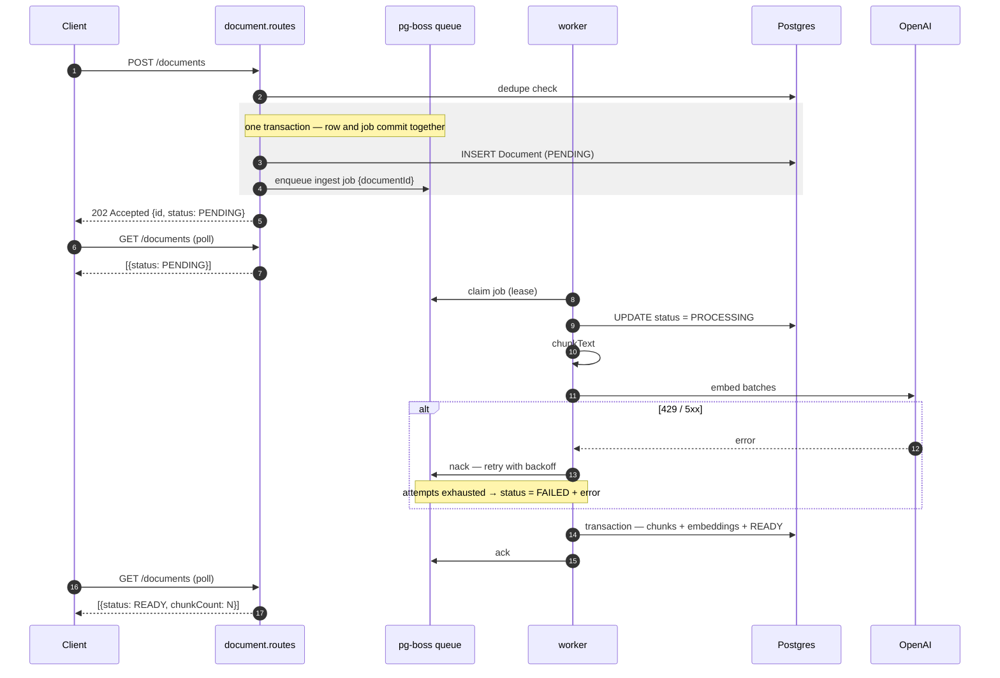
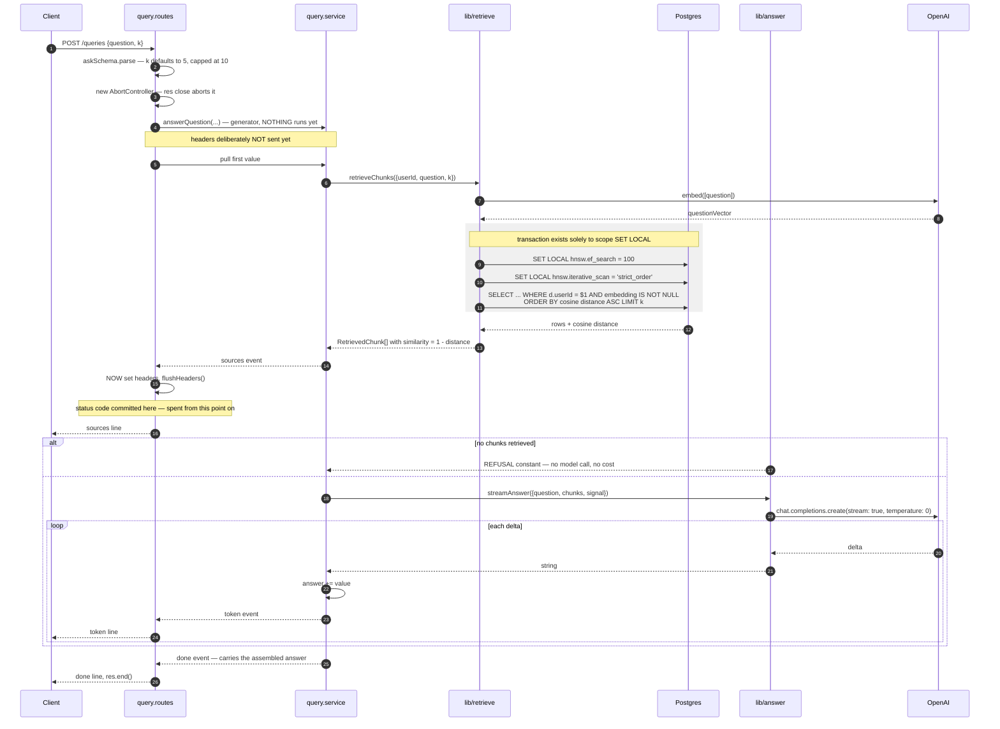

# Low-Level Design — RAG Knowledge Assistant

**Scope:** module structure, data model, state machines, sequence diagrams, API contracts,
algorithms and their parameters, error taxonomy, and concurrency semantics.

For topology, capacity, and scaling, see [HLD](hld.md). For the chronological decision log, see
[STATUS.md](../STATUS.md).

**Status legend:** ✅ built and verified · 🟡 built but degraded/incomplete · ⬜ designed, not built

---

## 1. Module structure

Backend layering is **routes → service → lib**, strictly one-directional.



| Layer | Knows about | Must never | Rule enforced by |
|---|---|---|---|
| `routes/` | HTTP, status codes, zod parsing | business logic | Review — each router is ~50 lines |
| `services/` | orchestration, transactions | `express`, `res`, headers | `query.service` yields **events**, not HTTP |
| `lib/` | one job each | HTTP, or each other's internals | No `express` import anywhere in `lib/` |

**One arrow breaks the pattern, and it should be called out rather than smoothed over:**
`document.routes → lib/pdf`. The upload route converts an HTTP artifact (a multipart buffer) into
domain input (text + pages), which is defensible as transport-adaptation — the same category of
work as zod-parsing a body. What is *less* defensible is that the route also joins the extracted
pages into `content`, and that join is part of the **dedupe contract**: `content` is what gets
hashed, so the separator must never change, yet it lives one layer away from `hashContent`. Logged
in §10.

**The load-bearing case is `query.service`.** It is an async generator yielding a typed
`QueryEvent` union and never touches `res`. Swapping NDJSON for SSE or WebSockets means rewriting
`query.routes.ts` only — the logic deciding *what an answer is* never reopens.

> **Frontend analogy:** `lib/` is a pure hook, `service/` is the container component holding
> orchestration, `routes/` is the thin view that knows about the DOM. The generator is
> `useSyncExternalStore`-shaped: it produces values and stays ignorant of who renders them.

### Dependency-injection seams ✅

Both expensive paths accept an optional `embedFn`:

```ts
ingestDocument({ userId, title, content, embedFn?: typeof embed })
retrieveChunks({ userId, question, k?, embedFn?: typeof embed })
```

This exists so the **database path** — including the tenant scoping in raw SQL — can be exercised
with a deterministic stub and no OpenAI bill. `pnpm smoke:ingest --fake` uses it. `createApp()` is
factored the same way, so supertest can hit routes in-memory without opening a port.

---

## 2. Data model



### Indexes and the reason each exists

| Index | Serves | Note |
|---|---|---|
| `User.email` UNIQUE | Login lookup | — |
| `Document @@unique([userId, contentHash])` | **Dedupe, enforced by the database** | Not merely checked in code — this is what makes ingestion idempotent under concurrency (§6) |
| `Document @@index([userId, createdAt DESC])` | `listDocuments` | Composite, sorted: Postgres seeks to the user's slice and walks it already ordered — no sort step |
| `Chunk @@index([documentId])` | Cascade delete, per-doc lookup | — |
| `Chunk_embedding_hnsw_idx` | ANN search | Hand-written SQL. `USING hnsw (embedding vector_cosine_ops) WITH (m=16, ef_construction=64)` |

### Invariants

1. **`chunkCount` is written in the same transaction as the rows it counts** — so it cannot drift.
   It is denormalised precisely so listing documents never needs a `COUNT(*)` join.
2. **`chunkIndex` is dense, 0-based, per document** — it is the citation anchor and the natural key
   used to match embedding `UPDATE`s back to inserted rows.
3. **`embedding` may be NULL** — a chunk written but not yet embedded. Retrieval must exclude these
   explicitly (§5.2).
4. **A `READY` document has `chunkCount` rows in `Chunk`, all with non-NULL embeddings.**
   🟡 Currently unenforced after a crash — see §4.

### The `Unsupported("vector(1536)")` consequence chain

Prisma knows the column exists and understands nothing about it. Three things follow, and each is
a place where the compiler stops helping:

| Consequence | Where | Mitigation |
|---|---|---|
| Cannot write it via `createMany` | `document.service.ts` | Two-step: insert text columns, then `UPDATE … = $1::vector` matched on `(documentId, chunkIndex)` |
| Cannot express `ORDER BY embedding <=> $1` | `lib/retrieve.ts` | `$queryRaw` — **tenant scope now hand-written** |
| Cannot represent the HNSW index in `schema.prisma` | migration | Hand-written SQL, applied with `migrate deploy` |

> ### ⚠️ `prisma migrate dev` is unsafe on this database
> `migrate dev` compares the DB to `schema.prisma`, sees an index it cannot account for, calls it
> drift, and generates a `DROP INDEX` to "fix" it. **This already corrupted migration history once
> and forced a database reset.** Author migrations by hand (or with `prisma migrate diff`) and
> apply with `migrate deploy`, which performs no drift detection. `migrate status` is safe.

---

## 3. Ingestion — state machine



Two 🟡 transitions are the write path's real defects, both documented in
[HLD §4.1](hld.md#41-the-known-gap-in-the-write-path-):

- **Stranded in `PROCESSING`** — if the process dies between the status update and the transaction,
  nothing ever moves the row. No lease, no timeout, no reaper.
- **`FAILED` is a dead end** — a failed row still satisfies `@@unique([userId, contentHash])`, so
  re-uploading the same text returns `200 { deduped: true }` and the user can never retry.

Both dissolve under a job queue: a lease expiry returns stranded work to the queue, and a retry
policy re-runs the pipeline against the existing row.

---

## 4. Ingestion — sequence

### 4.1 Current ✅/🟡 — synchronous, inside the request



**Why chunk + embed sit outside the transaction (steps 11–13):** chunking is CPU work and embedding
is a network round-trip. Holding a Postgres transaction open across a third-party API call pins a
pooled connection for the duration and invites timeouts under any concurrency at all. The
transaction covers only the writes, so a mid-write failure cannot leave half the chunks saved with
the document marked `READY`.

**Why the response is re-read (step 19):** it costs one cheap `SELECT` and makes `POST` respond
with the *same shape* as `GET /documents/:id`. The client gets one `Document` type, one renderer,
and a polling loop that doesn't special-case the response that started it.

### 4.2 Target ⬜ — enqueue and return



**Changes required at the route layer** — small, and worth enumerating because they are the whole
migration:

1. `201` becomes `202 Accepted`; the re-read at step 19 above returns a `PENDING` row.
2. The client can no longer assume `chunkCount` is populated on the create response.
3. [`DocumentList.tsx`](../web/src/components/DocumentList.tsx) needs a polling loop — the
   `status`/`error` fields it already renders become live rather than always-terminal.
4. `ingestDocument` keeps its exact signature and becomes the job handler's body. The eval harness
   calls the same function. **This is why the seam matters more than the queue.**

---

## 5. Query — sequence



### 5.1 The header-deferral design — the central constraint

**A response has exactly one status code, and it is committed the instant the first byte leaves.**
Before that, an error can be a clean `500`/`429`/`401`. After it, the client has already been told
`200 OK` and is parsing a body; a thrown error merely truncates the stream, which is
indistinguishable from a network drop.

So the error path forks on exactly one question — *have headers been sent?*

```
not yet   → rethrow → normal error middleware → real status code
already   → in-band {type:"error"} event → res.end() cleanly
```

**Generator laziness is what makes this work.** `answerQuestion` executes no line until the route
pulls the first value, so retrieval failures — a DB outage, an OpenAI 429 while embedding the
question — still land in the first branch while a real status is available. If the service eagerly
fetched, every failure would be a truncated 200.

An abort is checked *before* the error branch: the client leaving is not a failure, and the socket
is already gone.

### 5.2 Retrieval SQL — the annotated parts

| Element | Why it is there | What breaks without it |
|---|---|---|
| `WHERE d."userId" = $1` | ⚠️ **The tenant scope** | Full-corpus search across every user. No type error, no failing test. |
| `AND c.embedding IS NOT NULL` | Excludes unembedded chunks | `NULL <=> vector` is `NULL`, which sorts **last** under `NULLS LAST` — junk surfaces exactly when real matches run out, i.e. when it does the most damage |
| `<=>` (cosine distance) | Must match `vector_cosine_ops` in the index | **Silent** index bypass → sequential scan. Slow but correct — the failure mode that survives to production |
| `SET LOCAL`, not `SET` | Reverts on commit | `SET` mutates the *pooled connection's session* — one query's tuning becomes global config for whichever request gets that connection next |
| `$executeRawUnsafe` for the SETs | Postgres rejects bind params in `SET` — it parses as configuration, not a query | Safe **only** because both interpolated values are module-level constants. If either became caller-controlled this is SQL injection immediately. |
| `hnsw.iterative_scan = 'strict_order'` | Filtered-search recall | Silently under-returns; degrades as tenants are added ([HLD §8](hld.md#8-scaling-ladder)) |
| `ORDER BY … LIMIT k` | k capped 1–10 at the schema | Uncapped `k` is a client-controlled way to force an arbitrarily expensive prompt |

**`distance` vs `similarity`:** `<=>` returns cosine *distance* — 0 identical, 1 orthogonal,
2 opposite. **Lower is better**, the opposite of the intuition most people bring to a "score,"
which is why the field is named `distance`. `similarity = 1 - distance` is computed once so no
caller re-derives it (and gets it backwards in a template).

### 5.3 Prompt construction

```
system: 6 numbered rules — answer only from sources, never from training data,
        cite inline, emit REFUSAL verbatim when insufficient, don't speculate, be concise
user:   Sources:\n\n[1] (from "Title", chunk 0)\n<text>\n\n---\n\n[2] ...
        \n\n---\n\nQuestion: <question>
```

| Choice | Reason |
|---|---|
| Context **before** question | Models attend most reliably to a prompt's start and end; the question landing last keeps it in the strongest position. A stable prefix also makes prompt caching possible later. |
| Sources numbered from **1** | The markers appear in prose a human reads; `[0]` reads like a typo. The `n → sources[n-1]` off-by-one lives in exactly one place — the frontend renderer. |
| `temperature: 0` | Grounded QA, not writing. Also makes evals meaningful: under a non-deterministic model, a regression is indistinguishable from noise. |
| Fixed `REFUSAL` constant | A model left to its judgement writes a different apology every time, and a waffle is indistinguishable from a weak answer. A verbatim string is UI-detectable and eval-assertable. |
| Short-circuit on 0 chunks | The model cannot answer from empty context — asking is a guaranteed refusal that costs a round-trip and real money. Emitting the same constant keeps both paths indistinguishable to the client. |

---

## 6. Concurrency & idempotency

### Concurrent ingest of identical content ✅

`findByHash` is a **check**, not a guarantee. Two requests can both pass it and race to `INSERT`.

```
T1: findByHash → null          T2: findByHash → null
T1: INSERT ✓                   T2: INSERT ✗ P2002
                               T2: re-read winner → {deduped: true}
```

The unique constraint is the guarantee; the pre-check is an optimisation that avoids paying for
embeddings in the common case. The loser returns the winner's row rather than failing a request
that asked for something which now exists.

**This is exactly the property a job queue needs.** At-least-once delivery means a redelivered job
must not duplicate work, and `@@unique([userId, contentHash])` plus the `P2002` recovery already
provides it — built for a different reason, correct for this one.

> ⚠️ **One window remains open.** If the worker crashes *after* the transaction commits but
> *before* it acks the job, redelivery re-enters `ingestDocument` for a document that is already
> `READY`. The current code would find the row via `findByHash` and return `deduped: true` — safe.
> But a job handler keyed on `documentId` rather than content would skip the dedupe path entirely
> and re-insert chunks. **The job handler must therefore be idempotent on `documentId`:** check
> `status === 'READY'` and no-op, or delete existing chunks before re-inserting.

### Connection pooling ✅

`SET LOCAL` inside a transaction is the only safe way to tune a pooled connection. This is the
entire reason the read path has a transaction at all — there is nothing transactional about a
single `SELECT`.

### Client disconnect ✅

`res.on("close") → abort()` propagates through `answerQuestion` → `streamAnswer` → the OpenAI SDK's
`signal`. Without it, a closed tab leaves tokens streaming into a dead socket, billed in full.
Verified: an abort leaves no unhandled rejection.

---

## 7. API contracts

| Method | Route | Auth | Success | Errors |
|---|---|---|---|---|
| `GET` | `/health` | — | `200 {status, users}` | — |
| `POST` | `/auth/signup` | — | `201 {user, token}` | `400` invalid · `409` email taken |
| `POST` | `/auth/login` | — | `200 {user, token}` | `400` · `401` |
| `GET` | `/me` | ✅ | `200 {user}` | `401` |
| `POST` | `/documents` | ✅ | `201 {document, deduped:false}` · `200 {…, deduped:true}` | `400` · `401` · `413` · `429` · `500` |
| `POST` | `/documents/upload` | ✅ | *identical shape* — `201` / `200 {…, deduped:true}` | `400` not-a-PDF, corrupt, password-protected, no file, wrong field, text over 200k · `401` · `413` >4 MB · **`422`** parsed but no extractable text · `429` · `500` |
| `GET` | `/documents` | ✅ | `200 {documents: Summary[]}` | `401` |
| `GET` | `/documents/:id` | ✅ | `200 {document}` | `401` · **`404`** |
| `POST` | `/queries` | ✅ | `200` NDJSON stream | `400` · `401` · `500` before headers; in-band `error` after |

### Status-code decisions

| Choice | Reason |
|---|---|
| `200` + `deduped:true`, not `201` | `201 Created` would be a lie — the service recognised the content and created nothing. The flag lets the UI say "already in your library" instead of a misleading "uploaded". |
| **`404`, never `403`**, for another user's document | A `403` confirms the id exists, letting an attacker enumerate ids to map another tenant's library. Both 404s are byte-identical, so the message cannot become an oracle. |
| No zod validation on `:id` | Malformed, non-existent, and not-yours all answer identically. A `400` for "wrong format" would be the only distinguishable response, for no benefit. ⚠️ Depends on `Document.id` being a **text** column — switching to `@db.Uuid` makes Postgres reject the cast and turns this into a 500. |
| Unknown body keys **stripped**, not rejected | zod's object default. A client POSTing `status: "READY"` to skip the pipeline has the field silently dropped. |
| **`422`, not `400`**, for a scanned PDF | The request was well-formed *and* the file parsed cleanly — there is simply nothing in it to index. A `400` would send the user looking for a malformed file. The message names the actual cause ("this looks like a scanned PDF") because "empty document" describes the symptom, not the fix. |
| **`413`, not `400`**, for an oversized file | Semantically the payload-too-large case. Required its own `MulterError` branch in the error middleware: multer's error carries `code` but *not* the `type`/`status` pair the body-parser branch sniffs for, so before that branch existed a 12 MB upload returned `500 Internal Server Error` — wrong status, and it tells the user nothing they can act on. |
| Upload returns the **same body shape** as the JSON route | Lets the client keep one `DocumentSummary` type, one renderer, and one polling loop across both ingestion routes. The cost is one extra `SELECT` per upload; the saving is an entire duplicated code path in the UI. |

### The `/queries` NDJSON stream

`Content-Type: application/x-ndjson; charset=utf-8` · `Cache-Control: no-store` ·
`X-Accel-Buffering: no`

```jsonc
{"type":"sources","sources":[{"n":1,"documentId":"…","documentTitle":"…","chunkIndex":0,"page":7,"content":"…","similarity":0.82}]}
{"type":"token","value":"The "}
{"type":"token","value":"answer "}
{"type":"done","answer":"The answer is … [1]"}
// or, only after headers have been sent:
{"type":"error","message":"Failed to generate answer"}
```

`X-Accel-Buffering: no` tells nginx-style reverse proxies not to buffer. Without it a proxy may
hold the whole response and deliver it in one lump — the endpoint still "works" while the streaming
UX silently disappears **in production and only in production**.

`done` carries the fully assembled answer so a client that buffered nothing (a test, a `curl` pipe)
still gets complete text, and so "the stream ended" is distinguishable from "the connection
dropped."

`page` is `number | null` — a real page for chunks that came from a PDF, `null` for every
pasted-text document and `null` **permanently**, not "not yet". The client must therefore render a
fallback rather than a loading state. It deliberately does *not* fall back to showing `chunkIndex`:
"chunk 12" names an internal ordinal the reader has no way to look up, which is the opposite of
what a citation is for. Verified with a mixed corpus — one query returned a pasted source at
`page: null` alongside PDF sources carrying real page numbers, in the same `sources` array.

### Client-side stream parsing ✅

Two bugs that work perfectly on short ASCII answers and break on long or accented ones — the worst
possible failure schedule:

1. **A network chunk does not respect line boundaries.** Buffer and split on `\n`; keep the
   trailing partial line for the next chunk.
2. **A network chunk does not respect UTF-8 character boundaries.** `TextDecoder` must be used with
   `{ stream: true }`, or a multi-byte character split across chunks decodes to `�`.

Verified by feeding the parser a body one byte at a time.

**Citations are parsed at render time from the accumulated string**, never incrementally: mid-stream
a marker arrives as `[`, then `[1`, then `[1]`. Re-deriving each render makes a half-typed marker
render as literal text and become a chip the instant it completes.

---

## 8. Error taxonomy

| Class | Origin | Becomes | Handled at |
|---|---|---|---|
| Validation | zod `.parse()` throws `ZodError` | `400` + per-field details | `errorHandler` |
| Auth | missing/malformed/expired token | `401` — all failure modes identical | `requireAuth` |
| Not found / not yours | `findFirst` returns null | `404` — deliberately indistinguishable | service |
| Conflict | Prisma `P2002` | `409`, or dedupe recovery in ingestion | service |
| Payload too large (JSON) | `express.json()` limit | `413` | body-parser |
| Payload too large (upload) | `multer` `limits.fileSize` throws `MulterError` | `413` | `errorHandler` — **own branch**; `MulterError` has `code` but no `type`/`status`, so it does not match the body-parser predicate |
| Malformed multipart | `MulterError` `LIMIT_UNEXPECTED_FILE` / `LIMIT_FILE_COUNT` | `400` | `errorHandler` |
| Unparseable file | magic-byte check, or pdf.js throwing | `400` — "isn't a PDF" / "may be corrupt" / "password-protected" | `lib/pdf.ts` throws `HttpError` |
| Parsed but empty | `hasNoText()` — every page blank | `422` | upload route |
| Upstream failure | OpenAI, Postgres | `500`, or in-band `error` if mid-stream | service / route |
| **Post-header stream failure** | anything after `flushHeaders()` | `{type:"error"}` + clean close | `query.routes` |

`HttpError` carries `{ status, message, cause }`. `cause` preserves the original for logs while the
client sees only the safe message — an upstream stack trace must never reach a response body.

**Ingestion's failure bookkeeping is best-effort by design:** the `FAILED` status update is wrapped
in `.catch(() => {})` so that a failure *while recording a failure* cannot mask the original error.
The original always propagates.

---

## 9. Patterns in use

Real ones, from the code — not a list assembled to look longer.

| Pattern | Instance | Purpose |
|---|---|---|
| Layered architecture | routes → service → lib | Transport-free core |
| Dependency injection | `embedFn` seam | Test the DB path without paid calls |
| Factory | `createApp()` | Wiring separate from "start listening"; supertest without a port |
| State machine | `DocStatus` | Ingestion lifecycle is explicit and observable |
| Discriminated union | `QueryEvent` | `switch` narrows the payload; a new event forces every exhaustive consumer to handle it |
| Async generator | `answerQuestion`, `streamAnswer` | Backpressure, early `break`, and error propagation all work as normal control flow |
| Guard clause at the boundary | `requireAuth` at the **mount point** | A route added later cannot ship unauthenticated |
| Schema-as-type | zod `.infer` | One source of truth for runtime validation and compile-time types |

> **Frontend analogy for `QueryEvent`:** it is a Redux action union, or a typed `postMessage`
> protocol. Same discriminant, same exhaustiveness guarantee.

---

## 10. Known gaps

| Gap | Severity | Fix |
|---|---|---|
| Ingestion is synchronous 🟡 | **High** — timeouts, no retry, stranded rows | Queue + worker (§4.2) |
| `FAILED` documents cannot be retried 🟡 | **High** — dead end for the user | Job retry, or exclude `FAILED` from dedupe |
| Documents stranded in `PROCESSING` 🟡 | **High** — no reaper | Job lease expiry |
| No automated tests | **High** — `retrieve.ts` tenant scoping is uncovered raw SQL | supertest via `createApp()`; start with tenant isolation |
| `WEB_ORIGIN` bypasses zod validation 🟡 | Medium — silent CORS misconfiguration in prod | Move into `envSchema` |
| `k`, `chunkSize`, `chunkOverlap` unvalidated | Medium — chosen by judgement | M7 eval harness |
| Per-page chunking makes the page a **hard chunk boundary** | Medium — `chunkOverlap` cannot bridge a page break, and a PDF of short pages yields many tiny, weakly-retrievable chunks | Merge pass over consecutive short pages — needs a page *range* on `Chunk`, so a schema change. Gated on M7 measuring whether it matters. |
| Page-join lives in the route, not the service | Low — but it is part of the dedupe contract (§1) | Move extraction + join into a `ingestPdfDocument` service function; the route goes back to being thin |
| Uploaded file bytes are discarded | Low — deliberate (HLD §5), but re-processing cannot recover text a parser missed | Only matters if OCR or a better parser enters scope |
| `Math.sumPrecise` shim in `lib/pdf.ts` | Low — pdf.js calls a TC39 Stage 3 method absent from Node 24's V8 | Delete on Node 25+. Guarded, so it self-disables. |
| Answers are discarded | Medium — blocks history, caching, scoring | `Query` table |
| Token in `localStorage` 🟡 | Medium — XSS-readable | httpOnly cookies (forces the stream off Bearer) |
| No refresh token, 1h expiry 🟡 | Medium | Refresh + rotation |
| No rate limiting, no helmet | Medium | Deferred hardening |
| `listDocuments` unpaginated | Low — signature already takes an object | Cursor pagination |
| Answers rendered as preformatted text | Low — model emits markdown | Render + sanitise (text derives from user documents) |
