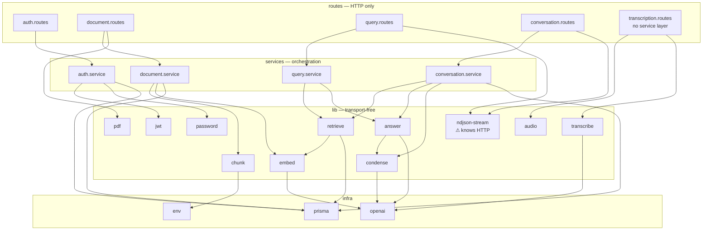
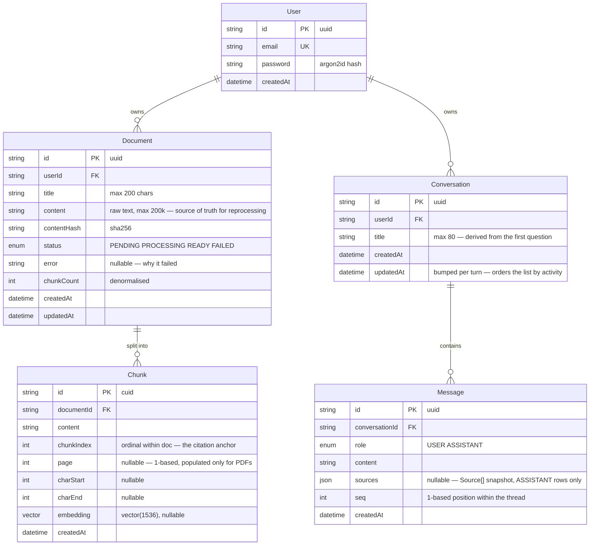
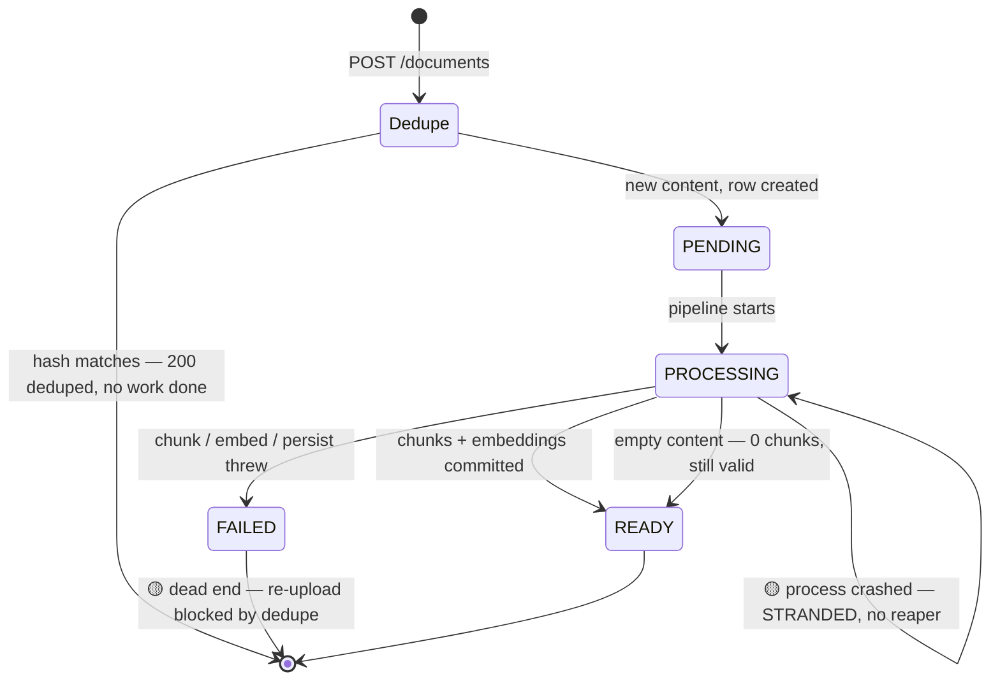
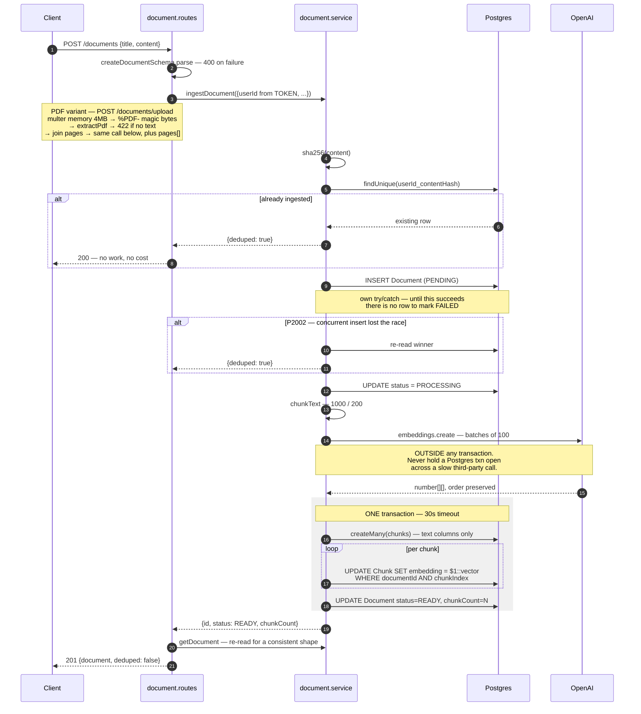
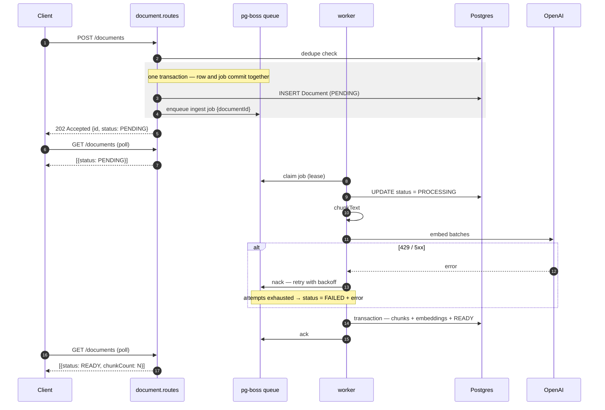
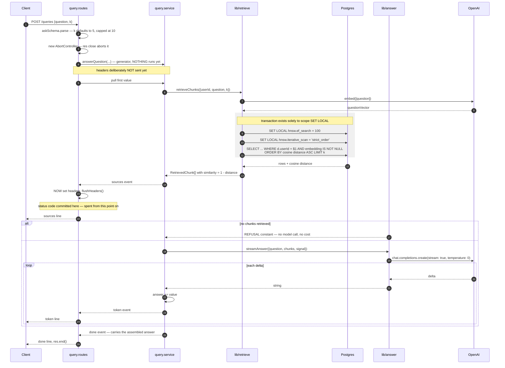
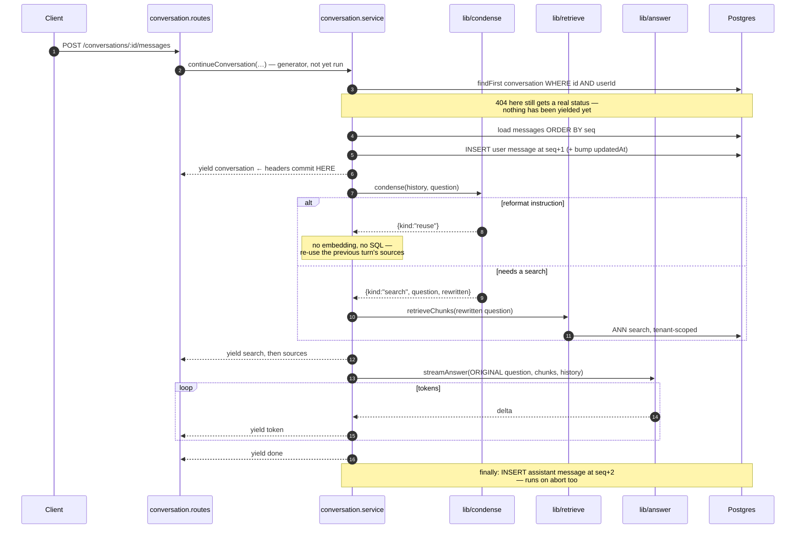

# Low-Level Design — RAG Knowledge Assistant

**Scope:** module structure, data model, state machines, sequence diagrams, API contracts,
algorithms and their parameters, error taxonomy, and concurrency semantics.

For topology, capacity, and scaling, see [HLD](hld.md). For what deploying this to a function
platform changed, see [deployment.md](deployment.md).

**Status legend:** ✅ built and verified · 🟡 built but degraded/incomplete · ⬜ designed, not built

---

## 1. Module structure

Backend layering is **routes → service → lib**, strictly one-directional.



| Layer | Knows about | Must never | Rule enforced by |
|---|---|---|---|
| `routes/` | HTTP, status codes, zod parsing | business logic | Review — each router is ~50 lines |
| `services/` | orchestration, transactions | `express`, `res`, headers | `query.service` yields **events**, not HTTP |
| `lib/` | one job each | HTTP, or each other's internals | No `express` import anywhere in `lib/` |

**`transcriptions/` has no service layer, and the absence is the point.** Every other module has one
because there is orchestration to hold: a transaction, a state machine, a generator yielding events.
This route validates a buffer, calls one library function and returns a string. A service here would
be a file that forwards its arguments — the layering exists to keep orchestration out of routes, not
to make every module the same shape, and adding an empty layer to satisfy symmetry is how a codebase
acquires files nobody can explain. If voice ever needs a decision made about it, that is when the
layer earns its place.

**Three arrows break the pattern, and all three should be called out rather than smoothed over.**

`document.routes → lib/pdf`. The upload route converts an HTTP artifact (a multipart buffer) into
domain input (text + pages), which is defensible as transport-adaptation — the same category of
work as zod-parsing a body. What is *less* defensible is that the route also joins the extracted
pages into `content`, and that join is part of the **dedupe contract**: `content` is what gets
hashed, so the separator must never change, yet it lives one layer away from `hashContent`. Logged
in §10.

`transcription.routes → lib/audio` is the same category as the PDF arrow above and less troubling,
because nothing it produces is part of a persistence contract. `sniffAudio` turns bytes into a
container identity, which is transport-adaptation in the same sense zod-parsing a body is. The one
thing worth noticing is *why* the route needs the answer: it names the file it hands to OpenAI, which
selects a demuxer from the extension. Browsers disagree about what they record — Chrome emits WebM,
Safari MP4 — so a client-supplied filename would make a Safari recording fail inside the paid call
for something knowable for free from the first twelve bytes.

`lib/ndjson-stream` imports `express` types, which the table above forbids. It is the deliberate
exception and it is named as such in the filename: it holds the response-writing loop, the deferred
headers and the disconnect-abort wiring shared by all three streaming routes. It moved out of
`query.routes.ts` when the conversation router needed identical behaviour on two more endpoints,
and it moved rather than being copied because the `headersSent` fork (§5.1) is the subtlest logic in
the codebase — three copies means the next correction lands in one of them. The alternative,
generalising the *routers* instead, would have coupled two modules that are allowed to diverge.

**The load-bearing case is the answer services.** Both are async generators yielding typed event
unions and neither touches `res`. Swapping NDJSON for SSE or WebSockets means rewriting
`lib/ndjson-stream.ts` — the logic deciding *what an answer is* never reopens.

**`conversation.service` is a sibling of `query.service`, not a superset.** It duplicates roughly
ten lines of orchestration and shares every primitive that matters. Folding history, preset sources
and persistence into `answerQuestion` would give one function three modes and, more importantly,
would move the rewrite step upstream of the retrieval that the eval harness scores (HLD §4.0). The
duplication is the cheaper of the two costs, and it is bounded — `Source`, `toSource` and the
`QueryEvent` union are imported from `queries/`, not re-declared, so a new event type breaks the
exhaustive `switch` in both clients.

> **Frontend analogy:** `lib/` is a pure hook, `service/` is the container component holding
> orchestration, `routes/` is the thin view that knows about the DOM. The generator is
> `useSyncExternalStore`-shaped: it produces values and stays ignorant of who renders them.

### Dependency-injection seams ✅

Both expensive paths accept an optional `embedFn`:

```ts
ingestDocument({ userId, title, content, embedFn?: typeof embed })
retrieveChunks({ userId, question, k?, embedFn?: typeof embed })
```

This exists so the **database path** — including the tenant scoping in raw SQL — can be exercised
with a deterministic stub and no OpenAI bill. `pnpm smoke:ingest --fake` uses it. `createApp()` is
factored the same way, and `pnpm test` now uses that: supertest hits routes in-memory without
opening a port, against the real middleware chain in the real order rather than a stubbed one.

**The test tiers, and why they are separate commands.** Merging them means CI is either expensive
or red for reasons unrelated to the change.

| Tier | Command | Needs | Determinism |
|---|---|---|---|
| Unit + HTTP | `pnpm test` | nothing | exact |
| Integration | *(not yet built)* | Postgres, stub embedder | exact |
| Eval | `pnpm eval:*` | Postgres + OpenAI | scored, not pass/fail |

The unit tier asserts only what resolves before the first query — `requireAuth` rejections, body
parser failures, routing, and pure functions like `chunkText`. One consequence worth knowing: an
oversized body returns `413`, not `401`, because `express.json()` is mounted app-wide and therefore
runs ahead of the auth guard. That ordering is pinned by a test, since the intuitive expectation is
the opposite.

Two smaller notes that cost real time to learn:

- **`tsx` strips types without checking them**, so a type error in a test file runs happily and
  fails as a confusing assertion instead. `pnpm test` runs `tsc --noEmit` first for that reason.
- **`env.ts` validates at import time and calls `process.exit(1)` on failure**, so importing
  `createApp` transitively requires `DATABASE_URL`, `JWT_SECRET` and `OPENAI_API_KEY` to exist even
  for tests that never open a socket. A committed `.env.test` of fake values satisfies it;
  `REDIS_URL` is left unset so `lib/redis.ts` exports `null` and no handle keeps the runner alive.

---

## 2. Data model



**Note the absent relationship.** `Message` has no edge to `Chunk`, and that is the modelling
decision worth defending in this diagram. See HLD §5: chunks are recreated on every re-ingest, so a
foreign key makes old citations vanish or dangle, while a citation is a claim about what the answer
was built from *at the time it was given*. The `sources` JSON column is that claim, copied.

### Indexes and the reason each exists

| Index | Serves | Note |
|---|---|---|
| `User.email` UNIQUE | Login lookup | — |
| `Document @@unique([userId, contentHash])` | **Dedupe, enforced by the database** | Not merely checked in code — this is what makes ingestion idempotent under concurrency (§6) |
| `Document @@index([userId, createdAt DESC])` | `listDocuments` | Composite, sorted: Postgres seeks to the user's slice and walks it already ordered — no sort step |
| `Chunk @@index([documentId])` | Cascade delete, per-doc lookup | — |
| `Chunk_embedding_hnsw_idx` | ANN search | Hand-written SQL. `USING hnsw (embedding vector_cosine_ops) WITH (m=16, ef_construction=64)` |
| `Conversation @@index([userId, updatedAt DESC])` | `listConversations` | Same composite-sorted shape as the document list: seek to the user's slice, walk it already ordered, no sort step |
| `Message @@unique([conversationId, seq])` | Transcript ordering **and** the append race | Does two jobs, which is why there is no separate `@@index([conversationId])` — a unique index is still an index (§6) |

### Invariants

1. **`chunkCount` is written in the same transaction as the rows it counts** — so it cannot drift.
   It is denormalised precisely so listing documents never needs a `COUNT(*)` join.
2. **`chunkIndex` is dense, 0-based, per document** — it is the citation anchor and the natural key
   used to match embedding `UPDATE`s back to inserted rows.
3. **`embedding` may be NULL** — a chunk written but not yet embedded. Retrieval must exclude these
   explicitly (§5.2).
4. **A `READY` document has `chunkCount` rows in `Chunk`, all with non-NULL embeddings.**
   🟡 Currently unenforced after a crash — see §4.
5. **`Message.seq` is dense and 1-based within a conversation**, and a turn writes the question at
   `seq` and its answer at `seq + 1`.
6. **A `USER` message is not guaranteed to be followed by an `ASSISTANT` one.** A turn aborted
   before the first token persists the question and no answer, deliberately (§5.4). The transcript
   shows it as an unanswered question; `toHistory` drops it before building a prompt, because two
   consecutive user messages is a shape no model API handles gracefully. **Transcript and prompt
   are different projections of the same rows, and this is the line between them.**
7. **`Message.sources` is non-empty only on `ASSISTANT` rows**, and is a snapshot, never a live
   reference.

### The `Unsupported("vector(1536)")` consequence chain

Prisma knows the column exists and understands nothing about it. Three things follow, and each is
a place where the compiler stops helping:

| Consequence | Where | Mitigation |
|---|---|---|
| Cannot write it via `createMany` | `document.service.ts` | Two-step: insert text columns, then `UPDATE … = $1::vector` matched on `(documentId, chunkIndex)` |
| Cannot express `ORDER BY embedding <=> $1` | `lib/retrieve.ts` | `$queryRaw` — **tenant scope now hand-written** |
| Cannot represent the HNSW index in `schema.prisma` | migration | Hand-written SQL, applied with `migrate deploy` |

> ### ⚠️ `prisma migrate dev` is unsafe on this database
> `migrate dev` compares the DB to `schema.prisma`, sees an index it cannot account for, calls it
> drift, and generates a `DROP INDEX` to "fix" it. **This already corrupted migration history once
> and forced a database reset.** Author migrations by hand (or with `prisma migrate diff`) and
> apply with `migrate deploy`, which performs no drift detection. `migrate status` is safe.

---

## 3. Ingestion — state machine



Two 🟡 transitions are the write path's real defects, both documented in
[HLD §4.1](hld.md#41-the-known-gap-in-the-write-path-):

- **Stranded in `PROCESSING`** — if the process dies between the status update and the transaction,
  nothing ever moves the row. No lease, no timeout, no reaper.
- **`FAILED` is a dead end** — a failed row still satisfies `@@unique([userId, contentHash])`, so
  re-uploading the same text returns `200 { deduped: true }` and the user can never retry.

Both dissolve under a job queue: a lease expiry returns stranded work to the queue, and a retry
policy re-runs the pipeline against the existing row.

---

## 4. Ingestion — sequence

### 4.1 Current ✅/🟡 — synchronous, inside the request



**Why chunk + embed sit outside the transaction (steps 11–13):** chunking is CPU work and embedding
is a network round-trip. Holding a Postgres transaction open across a third-party API call pins a
pooled connection for the duration and invites timeouts under any concurrency at all. The
transaction covers only the writes, so a mid-write failure cannot leave half the chunks saved with
the document marked `READY`.

**Why the response is re-read (step 19):** it costs one cheap `SELECT` and makes `POST` respond
with the *same shape* as `GET /documents/:id`. The client gets one `Document` type, one renderer,
and a polling loop that doesn't special-case the response that started it.

### 4.2 Target ⬜ — enqueue and return



**Changes required at the route layer** — small, and worth enumerating because they are the whole
migration:

1. `201` becomes `202 Accepted`; the re-read at step 19 above returns a `PENDING` row.
2. The client can no longer assume `chunkCount` is populated on the create response.
3. [`DocumentList.tsx`](../web/src/components/DocumentList.tsx) needs a polling loop — the
   `status`/`error` fields it already renders become live rather than always-terminal.
4. `ingestDocument` keeps its exact signature and becomes the job handler's body. The eval harness
   calls the same function. **This is why the seam matters more than the queue.**

---

## 5. Query — sequence



### 5.1 The header-deferral design — the central constraint

**A response has exactly one status code, and it is committed the instant the first byte leaves.**
Before that, an error can be a clean `500`/`429`/`401`. After it, the client has already been told
`200 OK` and is parsing a body; a thrown error merely truncates the stream, which is
indistinguishable from a network drop.

So the error path forks on exactly one question — *have headers been sent?*

```
not yet   → rethrow → normal error middleware → real status code
already   → in-band {type:"error"} event → res.end() cleanly
```

**Generator laziness is what makes this work.** `answerQuestion` executes no line until the route
pulls the first value, so retrieval failures — a DB outage, an OpenAI 429 while embedding the
question — still land in the first branch while a real status is available. If the service eagerly
fetched, every failure would be a truncated 200.

An abort is checked *before* the error branch: the client leaving is not a failure, and the socket
is already gone.

### 5.2 Retrieval SQL — the annotated parts

| Element | Why it is there | What breaks without it |
|---|---|---|
| `WHERE d."userId" = $1` | ⚠️ **The tenant scope** | Full-corpus search across every user. No type error, no failing test. |
| `AND c.embedding IS NOT NULL` | Excludes unembedded chunks | `NULL <=> vector` is `NULL`, which sorts **last** under `NULLS LAST` — junk surfaces exactly when real matches run out, i.e. when it does the most damage |
| `<=>` (cosine distance) | Must match `vector_cosine_ops` in the index | **Silent** index bypass → sequential scan. Slow but correct — the failure mode that survives to production |
| `SET LOCAL`, not `SET` | Reverts on commit | `SET` mutates the *pooled connection's session* — one query's tuning becomes global config for whichever request gets that connection next |
| `$executeRawUnsafe` for the SETs | Postgres rejects bind params in `SET` — it parses as configuration, not a query | Safe **only** because both interpolated values are module-level constants. If either became caller-controlled this is SQL injection immediately. |
| `hnsw.iterative_scan = 'strict_order'` | Filtered-search recall | Silently under-returns; degrades as tenants are added ([HLD §8](hld.md#8-scaling-ladder)) |
| `ORDER BY … LIMIT k` | k capped 1–10 at the schema | Uncapped `k` is a client-controlled way to force an arbitrarily expensive prompt |

**`distance` vs `similarity`:** `<=>` returns cosine *distance* — 0 identical, 1 orthogonal,
2 opposite. **Lower is better**, the opposite of the intuition most people bring to a "score,"
which is why the field is named `distance`. `similarity = 1 - distance` is computed once so no
caller re-derives it (and gets it backwards in a template).

### 5.3 Prompt construction

```
system: 6 numbered rules — answer only from sources, never from training data,
        cite inline, emit REFUSAL verbatim when insufficient, don't speculate, be concise
        + 3 more rules, appended ONLY when history is present (§5.4)
[history: recent turns, citation-stripped, assistant answers truncated — chat only]
user:   Sources:\n\n[1] (from "Title", chunk 0)\n<text>\n\n---\n\n[2] ...
        \n\n---\n\nQuestion: <question>
```

| Choice | Reason |
|---|---|
| Context **before** question | Models attend most reliably to a prompt's start and end; the question landing last keeps it in the strongest position. A stable prefix also makes prompt caching possible later. |
| Sources numbered from **1** | The markers appear in prose a human reads; `[0]` reads like a typo. The `n → sources[n-1]` off-by-one lives in exactly one place — the frontend renderer. |
| `temperature: 0` | Grounded QA, not writing. Also makes evals meaningful: under a non-deterministic model, a regression is indistinguishable from noise. |
| Fixed `REFUSAL` constant | A model left to its judgement writes a different apology every time, and a waffle is indistinguishable from a weak answer. A verbatim string is UI-detectable and eval-assertable. |
| Short-circuit on 0 chunks | The model cannot answer from empty context — asking is a guaranteed refusal that costs a round-trip and real money. Emitting the same constant keeps both paths indistinguishable to the client. |
| Multi-turn rules **appended**, never edited in | `SYSTEM_PROMPT` is the exact string the eval harness scores. Editing it to mention conversations would move every number the harness produces, and the shift would be indistinguishable from a retrieval regression. Single-turn requests to OpenAI are byte-identical to what they were before chat existed. |

### 5.4 The chat turn — what differs



Four things in that diagram are decisions rather than mechanics.

**The first yield is placed after two writes, on purpose.** By the time `conversation` is emitted,
a conversation row and a message row exist — so a later failure cannot be a clean HTTP status
(§5.1), and a retrieval error becomes an in-band `error` event on a `200`. That is a real cost,
accepted for a specific reason: failing with a `500` and no id would leave the client unaware of
persisted state it owns, holding a thread with a question in it and no way to navigate there.
Telling the client about a resource that genuinely exists is the honest move, and the `error` event
was built for the failures that follow. Ownership resolution deliberately happens *before* the
yield, which is why `404` still works.

**The rewrite drives retrieval; the original question drives generation.** `streamAnswer` receives
the user's literal words, never the rewritten query. Answering the rewrite would turn "make that
shorter" into a re-answer of a question nobody asked.

**The re-use branch runs no embedding call and no SQL.** `Source` structurally satisfies
`ContextChunk` — the narrow type `answer.ts` actually needs — so stored citations pass straight
back in as context with no adapter and no synthetic `chunkId`/`distance` invented to satisfy a
type. Narrow the input, widen the callers.

**The assistant write is in a `finally`.** When the user hits Stop, `for await` calls `.return()`
on the generator, which runs `finally` and nothing else — a plain save after the loop would never
execute, and the thread would hold a question whose answer was discarded. The partial is kept, as
ChatGPT does. The write is `.catch`-wrapped because an exception raised *inside* a `finally`
replaces whatever was propagating, so a database hiccup during cleanup would erase the real error,
including the abort that got there.

#### The citation-stripping trap, and why it is worth reading twice

Historical assistant answers are stripped of their `[n]` markers before entering a prompt, because
turn 1's `[2]` and turn 3's `[2]` were numbered against different retrievals — replaying them
invites the model to reuse a numbering that no longer means anything.

On a **re-use** turn that reasoning inverts: the sources being sent *are* the previous turn's, so
those markers are still valid, and stripping them is simply wrong.

It was also actively harmful, which is how it was found. Observed live: the model was shown its own
previous answer with every citation removed, asked to reproduce it more briefly — and copied what
it saw, dropping the markers. A system-prompt rule explicitly requiring citations on reformat
requests was added and **lost to the example directly above it**. The fix is
`trimHistory(history, keepLastCitations)`, true only on re-use and only for the final message.

The general lesson, which outlives this codebase: **a demonstration in the context window beats an
instruction in the system prompt.** If the model is doing something a rule forbids, check what the
prompt is *showing* it before adding another rule.

---

## 6. Concurrency & idempotency

### Concurrent ingest of identical content ✅

`findByHash` is a **check**, not a guarantee. Two requests can both pass it and race to `INSERT`.

```
T1: findByHash → null          T2: findByHash → null
T1: INSERT ✓                   T2: INSERT ✗ P2002
                               T2: re-read winner → {deduped: true}
```

The unique constraint is the guarantee; the pre-check is an optimisation that avoids paying for
embeddings in the common case. The loser returns the winner's row rather than failing a request
that asked for something which now exists.

**This is exactly the property a job queue needs.** At-least-once delivery means a redelivered job
must not duplicate work, and `@@unique([userId, contentHash])` plus the `P2002` recovery already
provides it — built for a different reason, correct for this one.

> ⚠️ **One window remains open.** If the worker crashes *after* the transaction commits but
> *before* it acks the job, redelivery re-enters `ingestDocument` for a document that is already
> `READY`. The current code would find the row via `findByHash` and return `deduped: true` — safe.
> But a job handler keyed on `documentId` rather than content would skip the dedupe path entirely
> and re-insert chunks. **The job handler must therefore be idempotent on `documentId`:** check
> `status === 'READY'` and no-op, or delete existing chunks before re-inserting.

### Concurrent appends to one conversation ✅

The same shape as the dedupe race above, and solved the same way: **the database decides, not the
application.**

A turn computes its position by reading the thread's last `seq` and adding one. Two browser tabs
posting into the same thread both read `seq = 4` and both try to write `seq = 5`. Without a
constraint both succeed, and the transcript silently interleaves two conversations into one
unreadable thread — a corruption with no error attached to it, which is the worst kind.

`@@unique([conversationId, seq])` makes the second writer lose with `P2002`, which the service maps
to a **`409`** rather than a `500`: nothing is broken, the client's view is stale, and a refetch
then a retry succeeds. The message says so.

Two properties worth naming. First, the constraint is doing *ordering* work as well as *race* work,
which is why there is no separate index on `conversationId`. Second, the check-then-write is
deliberately optimistic — serialising every append behind a `SELECT … FOR UPDATE` would be correct
and would also make the common case (one user, one tab) pay for a case that essentially never
happens.

### Connection pooling ✅

`SET LOCAL` inside a transaction is the only safe way to tune a pooled connection. This is the
entire reason the read path has a transaction at all — there is nothing transactional about a
single `SELECT`.

### Client disconnect ✅

`res.on("close") → abort()` propagates through the answer service → `streamAnswer` → the OpenAI
SDK's `signal`. Without it, a closed tab leaves tokens streaming into a dead socket, billed in full.
Verified: an abort leaves no unhandled rejection.

On the chat path an abort has a second obligation: **the partial answer must still be persisted.**
`for await` calls `.return()` on the generator when the consumer stops, which runs `finally` and
nothing else — so the write lives there rather than after the loop. Discarding it would leave the
thread holding a question whose answer was thrown away, and the next turn would then hand the model
two consecutive user messages. `condense` is the one place an abort is deliberately re-thrown rather
than swallowed: every *other* failure there falls back to the raw question, but continuing after a
disconnect would mean paying for retrieval and generation nobody will read.

---

## 7. API contracts

| Method | Route | Auth | Success | Errors |
|---|---|---|---|---|
| `GET` | `/health` | — | `200 {status, users}` | — |
| `POST` | `/auth/signup` | — | `201 {user, token}` | `400` invalid · `409` email taken |
| `POST` | `/auth/login` | — | `200 {user, token}` | `400` · `401` |
| `GET` | `/me` | ✅ | `200 {user}` | `401` |
| `POST` | `/documents` | ✅ | `201 {document, deduped:false}` · `200 {…, deduped:true}` | `400` · `401` · `413` · `429` · `500` |
| `POST` | `/documents/upload` | ✅ | *identical shape* — `201` / `200 {…, deduped:true}` | `400` not-a-PDF, corrupt, password-protected, no file, wrong field, text over 200k · `401` · `413` >4 MB · **`422`** parsed but no extractable text · `429` · `500` |
| `GET` | `/documents` | ✅ | `200 {documents: Summary[], nextCursor}` | `401` |
| `GET` | `/documents/:id` | ✅ | `200 {document}` | `401` · **`404`** |
| `POST` | `/queries` | ✅ | `200` NDJSON stream | `400` · `401` · `429` · `500` before headers; in-band `error` after |
| `POST` | `/conversations` | ✅ | `200` NDJSON stream — starts a thread | `400` · `401` · `429` · `500` before headers; in-band `error` after |
| `POST` | `/conversations/:id/messages` | ✅ | `200` NDJSON stream — continues one | `400` · `401` · **`404`** · **`409`** · `429` · `500` |
| `GET` | `/conversations` | ✅ | `200 {conversations, nextCursor}` | `400` bad `limit` · `401` |
| `GET` | `/conversations/:id` | ✅ | `200 {conversation}` incl. `messages[]` | `401` · **`404`** |
| `DELETE` | `/conversations/:id` | ✅ | **`204`** | `401` · **`404`** |
| `POST` | `/transcriptions` | ✅ | `200 {text}` | `400` no file, wrong field, under the byte floor, bytes are not audio · `401` · `413` >1 MB · **`422`** decoded fine, nothing said · `429` · `500` |

### Status-code decisions

| Choice | Reason |
|---|---|
| `200` + `deduped:true`, not `201` | `201 Created` would be a lie — the service recognised the content and created nothing. The flag lets the UI say "already in your library" instead of a misleading "uploaded". |
| **`404`, never `403`**, for another user's document | A `403` confirms the id exists, letting an attacker enumerate ids to map another tenant's library. Both 404s are byte-identical, so the message cannot become an oracle. |
| No zod validation on `:id` | Malformed, non-existent, and not-yours all answer identically. A `400` for "wrong format" would be the only distinguishable response, for no benefit. ⚠️ Depends on `Document.id` being a **text** column — switching to `@db.Uuid` makes Postgres reject the cast and turns this into a 500. |
| Unknown body keys **stripped**, not rejected | zod's object default. A client POSTing `status: "READY"` to skip the pipeline has the field silently dropped. |
| **`422`, not `400`**, for a scanned PDF | The request was well-formed *and* the file parsed cleanly — there is simply nothing in it to index. A `400` would send the user looking for a malformed file. The message names the actual cause ("this looks like a scanned PDF") because "empty document" describes the symptom, not the fix. |
| **`413`, not `400`**, for an oversized file | Semantically the payload-too-large case. Required its own `MulterError` branch in the error middleware: multer's error carries `code` but *not* the `type`/`status` pair the body-parser branch sniffs for, so before that branch existed a 12 MB upload returned `500 Internal Server Error` — wrong status, and it tells the user nothing they can act on. |
| Upload returns the **same body shape** as the JSON route | Lets the client keep one `DocumentSummary` type, one renderer, and one polling loop across both ingestion routes. The cost is one extra `SELECT` per upload; the saving is an entire duplicated code path in the UI. |
| `POST /conversations` answers **`200`, not `201`** | The status is committed before the work happens (§5.1), so `201 Created` cannot be conditional on anything. The `conversation` event carries the new id instead — which the client needs anyway, to correct the URL. |
| Starting a thread and answering its first question are **one request** | The alternative is `POST` then `POST`, which costs a round trip before the user sees anything and leaves empty conversations behind whenever the second call never arrives. A thread with no question in it is not worth representing. |
| Thread id is a **path parameter**, never a body field | Identity, not payload. A body that can disagree with the path is a bug waiting to be written. |
| **`409`** when two tabs append to one thread | The `@@unique([conversationId, seq])` violation surfaces as `P2002` and becomes a `409`, not a `500`: nothing is broken, the client's view of the thread is simply stale, and a refetch then a retry works. Without the constraint both writes succeed and two conversations silently interleave into one unreadable transcript. |
| **`204`**, not `200`, for delete | The resource is gone; returning the deleted object invites a client to render something the server just destroyed. `deleteMany` is used rather than `delete` so "not mine" and "does not exist" both come back as a count of zero → the same `404`. |
| Rate limiters on the two chat **POSTs**, not at the mount point | Unlike `/queries`, this router mixes expensive writes with cheap reads. Budgeting `GET /conversations` against a daily *answer* limit would lock a user out of transcripts they have already paid for. |
| **`422`, not `400`**, for a silent recording | Exactly parallel to the scanned-PDF case: the request was well-formed and the audio decoded cleanly, there was simply nothing said in it. Note what this does **not** catch — an empty transcript is the honest failure, while a *hallucinated* one arrives as ordinary non-empty text with no marker on it. That is bounded by a byte floor here and a loudness gate in the browser, not by a keyword blocklist, which would be a guess that fails open on every phrase not in it. |
| `413` resolves its limit from **`MulterError.field`** | Two multipart routes now carry different caps (4 MB for a PDF, 1 MB for audio) behind one error handler, so a hardcoded number would be correct on one route and a lie on the other — the exact drift `lib/upload.ts` was created to prevent, arriving from a new direction. The field name is part of each route's contract, not an incidental detail. An unrecognised field omits the number entirely rather than guessing: "too large" with no figure is unhelpful, while a wrong figure is trusted and retried against. |
| Size checked **before** the container sniff | A truncated recording fails both. Reporting the format problem would send the user to fix something that is not wrong, so the cheaper and more specific check runs first. |
| No zod schema on `/transcriptions` | There is no body to validate — one file part, and every rule about it (present, large enough, small enough, actually audio) is a property of bytes rather than of a parsed object. A schema here would validate the empty set. |

### The `/queries` NDJSON stream

`Content-Type: application/x-ndjson; charset=utf-8` · `Cache-Control: no-store` ·
`X-Accel-Buffering: no`

```jsonc
{"type":"sources","sources":[{"n":1,"documentId":"…","documentTitle":"…","chunkIndex":0,"page":7,"content":"…","similarity":0.82}]}
{"type":"token","value":"The "}
{"type":"token","value":"answer "}
{"type":"done","answer":"The answer is … [1]"}
// or, only after headers have been sent:
{"type":"error","message":"Failed to generate answer"}
```

`X-Accel-Buffering: no` tells nginx-style reverse proxies not to buffer. Without it a proxy may
hold the whole response and deliver it in one lump — the endpoint still "works" while the streaming
UX silently disappears **in production and only in production**.

`done` carries the fully assembled answer so a client that buffered nothing (a test, a `curl` pipe)
still gets complete text, and so "the stream ended" is distinguishable from "the connection
dropped."

**The chat stream is the same four events plus two**, reusing the union rather than redeclaring it,
so a new event type breaks the exhaustive `switch` in both clients:

```jsonc
{"type":"conversation","conversationId":"…","title":"What does the handbook say…","messageId":"…"}
{"type":"search","query":"What is the duration of parental leave?","rewritten":true,"reused":false}
// …then sources / token / done / error exactly as above
```

`conversation` arrives first because the client needs the id to correct its URL, and it does so with
`history.replaceState` rather than a router navigation — a real navigation would unmount the
component and kill the stream in flight.

`search` exists so the rewrite is visible rather than magic. "How long is it?" quietly becoming
"What is the duration of parental leave?" is the most surprising thing the system does, and a bad
rewrite and bad retrieval look identical from the outside while having completely different fixes.
`reused: true` means no search ran at all. ⚠️ **Not persisted** — it is a property of the turn, not
of the stored message, so it is gone on reload. Logged in §10.

`page` is `number | null` — a real page for chunks that came from a PDF, `null` for every
pasted-text document and `null` **permanently**, not "not yet". The client must therefore render a
fallback rather than a loading state. It deliberately does *not* fall back to showing `chunkIndex`:
"chunk 12" names an internal ordinal the reader has no way to look up, which is the opposite of
what a citation is for. Verified with a mixed corpus — one query returned a pasted source at
`page: null` alongside PDF sources carrying real page numbers, in the same `sources` array.

### Client-side stream parsing ✅

Two bugs that work perfectly on short ASCII answers and break on long or accented ones — the worst
possible failure schedule:

1. **A network chunk does not respect line boundaries.** Buffer and split on `\n`; keep the
   trailing partial line for the next chunk.
2. **A network chunk does not respect UTF-8 character boundaries.** `TextDecoder` must be used with
   `{ stream: true }`, or a multi-byte character split across chunks decodes to `�`.

Verified by feeding the parser a body one byte at a time.

**Citations are parsed at render time from the accumulated string**, never incrementally: mid-stream
a marker arrives as `[`, then `[1`, then `[1]`. Re-deriving each render makes a half-typed marker
render as literal text and become a chip the instant it completes.

---

## 8. Error taxonomy

| Class | Origin | Becomes | Handled at |
|---|---|---|---|
| Validation | zod `.parse()` throws `ZodError` | `400` + per-field details | `errorHandler` |
| Auth | missing/malformed/expired token | `401` — all failure modes identical | `requireAuth` |
| Not found / not yours | `findFirst` returns null | `404` — deliberately indistinguishable | service |
| Conflict | Prisma `P2002` | `409`, or dedupe recovery in ingestion | service |
| Payload too large (JSON) | `express.json()` limit | `413` | body-parser |
| Payload too large (upload) | `multer` `limits.fileSize` throws `MulterError` | `413` | `errorHandler` — **own branch**; `MulterError` has `code` but no `type`/`status`, so it does not match the body-parser predicate |
| Malformed multipart | `MulterError` `LIMIT_UNEXPECTED_FILE` / `LIMIT_FILE_COUNT` | `400` | `errorHandler` |
| Unparseable file | magic-byte check, or pdf.js throwing | `400` — "isn't a PDF" / "may be corrupt" / "password-protected" | `lib/pdf.ts` throws `HttpError` |
| Parsed but empty | `hasNoText()` — every page blank | `422` | upload route |
| Upstream failure | OpenAI, Postgres | `500`, or in-band `error` if mid-stream | service / route |
| **Post-header stream failure** | anything after `flushHeaders()` | `{type:"error"}` + clean close | `query.routes` |

`HttpError` carries `{ status, message, cause }`. `cause` preserves the original for logs while the
client sees only the safe message — an upstream stack trace must never reach a response body.

**Ingestion's failure bookkeeping is best-effort by design:** the `FAILED` status update is wrapped
in `.catch(() => {})` so that a failure *while recording a failure* cannot mask the original error.
The original always propagates.

---

## 9. Patterns in use

Real ones, from the code — not a list assembled to look longer.

| Pattern | Instance | Purpose |
|---|---|---|
| Layered architecture | routes → service → lib | Transport-free core |
| Dependency injection | `embedFn` seam | Test the DB path without paid calls |
| Factory | `createApp()` | Wiring separate from "start listening"; supertest without a port |
| State machine | `DocStatus` | Ingestion lifecycle is explicit and observable |
| Discriminated union | `QueryEvent` | `switch` narrows the payload; a new event forces every exhaustive consumer to handle it |
| Async generator | `answerQuestion`, `streamAnswer` | Backpressure, early `break`, and error propagation all work as normal control flow |
| Guard clause at the boundary | `requireAuth` at the **mount point** | A route added later cannot ship unauthenticated |
| Schema-as-type | zod `.infer` | One source of truth for runtime validation and compile-time types |
| Buffer-and-flush over a stream | `lib/ndjson.ts` (lines) · `lib/speech.ts` (sentences) | A network chunk respects no line boundary and a token respects no sentence boundary. Both accumulate, emit only complete units, and hold the remainder — and both fail identically if skipped: perfectly on short input, badly on long input |
| Two projections of one source | `toHistory` vs. the transcript · `toSpeech` vs. the rendered answer | The same rows or the same string serve two audiences with opposite rules. Deriving both rather than storing either keeps them from drifting |

> **Frontend analogy for `QueryEvent`:** it is a Redux action union, or a typed `postMessage`
> protocol. Same discriminant, same exhaustiveness guarantee.

---

## 10. Known gaps

| Gap | Severity | Fix |
|---|---|---|
| Ingestion is synchronous 🟡 | **High** — timeouts, no retry, stranded rows | Queue + worker (§4.2) |
| `FAILED` documents cannot be retried 🟡 | **High** — dead end for the user | Job retry, or exclude `FAILED` from dedupe |
| Documents stranded in `PROCESSING` 🟡 | **High** — no reaper | Job lease expiry |
| No **integration** tests 🟡 | **High** — `retrieve.ts` tenant scoping is uncovered raw SQL, and the unit tier cannot reach it: proving isolation needs two real users with real rows | An integration tier against real Postgres with a stub `embedFn`. Start with tenant isolation, then the P2002 dedupe race and NDJSON line buffering. The unit + HTTP tier (`pnpm test`) covers everything resolving before the first query. |
| `WEB_ORIGIN` bypasses zod validation 🟡 | Medium — silent CORS misconfiguration in prod | Move into `envSchema` |
| `k`, `chunkSize`, `chunkOverlap` unvalidated | Medium — chosen by judgement | M7 eval harness |
| Per-page chunking makes the page a **hard chunk boundary** | Medium — `chunkOverlap` cannot bridge a page break, and a PDF of short pages yields many tiny, weakly-retrievable chunks | Merge pass over consecutive short pages — needs a page *range* on `Chunk`, so a schema change. Gated on M7 measuring whether it matters. |
| Page-join lives in the route, not the service | Low — but it is part of the dedupe contract (§1) | Move extraction + join into a `ingestPdfDocument` service function; the route goes back to being thin |
| Uploaded file bytes are discarded | Low — deliberate (HLD §5), but re-processing cannot recover text a parser missed | Only matters if OCR or a better parser enters scope |
| `Math.sumPrecise` shim in `lib/pdf.ts` | Low — pdf.js calls a TC39 Stage 3 method absent from Node 24's V8 | Delete on Node 25+. Guarded, so it self-disables. |
| No tests for the conversations module 🟡 | **High** — the newest and least exercised code in the repo. `condense`'s fallback guards, `toHistory`'s orphan-dropping and `titleFromQuestion` are pure functions and belong in the unit tier today; the persistence path, the `seq` race and the abort-writes-a-partial behaviour need the integration tier below. Verified by hand against a real database and a real model, which is not the same thing | Unit tests now, integration tier with the rest |
| The rewritten query is not persisted | Low — shown live via the `search` event, lost on reload, so a returning user cannot see why a turn retrieved what it did | A nullable column on `Message`; deferred as a second migration for a debugging affordance |
| Rewrite quality is unmeasured | Medium — a rewrite that loses intent produces confident retrieval of the wrong passage, which reads exactly like a retrieval regression | hit-rate@k on rewritten vs. raw follow-up over a multi-turn set (HLD §11) |
| Answers from `/queries` are still discarded | Low — chat persists its own; the single-turn path deliberately does not, and the eval harness collects the generator directly rather than reading rows | Nothing planned |
| Token in `localStorage` 🟡 | Medium — XSS-readable | httpOnly cookies (forces the stream off Bearer) |
| No refresh token, 1h expiry 🟡 | Medium | Refresh + rotation |
| No `helmet` | Medium — rate limiting is done (Redis-backed, `middleware/rate-limit.ts`); security headers are not | Deferred hardening |
| Concurrency cap is per-instance | Low — the limiters moved to Redis, the `Map` deliberately did not, so "2 streams per user" reads as "2 per instance" behind an autoscaler | Nothing: it counts sockets this process owns, and the per-user cost bound now belongs to the Redis limiters |
| Conversation list has no "load more" in the UI | Low — the api is cursor-paginated and the client fetches only the first page on `/chat` | Wire the cursor through, as `/documents` already does |
| Answers rendered as preformatted text | Low — model emits markdown | Render + sanitise (text derives from user documents) |
| No test runner in `web` at all 🟡 | **High** — it now hides two pure, deterministic modules: `lib/citations.ts` (the `[n]` parser, whose module-level `/g` regex is exactly the kind of thing a test exists for) and `lib/speech.ts` (the spoken projection and the sentence buffer). The speech module was checked by driving a simulated token stream through it, which found a real defect — the segmenter breaking after "e.g." — and that check exists nowhere in the repo | A `node:test` + `tsx` setup in `web`, mirroring `api`. It also forces the open question of whether the citation parser should be one implementation shared with the eval harness or two that can drift |
| Voice input is unevaluated | Medium — transcription sits upstream of *everything*, and a mishearing is a well-formed question that retrieves the wrong passages with nothing to mark it as bad input | hit-rate@k on transcribed questions vs. their typed originals, over a fixture set of recordings. That fixture set is also the only thing that would justify persisting audio, which is why none is persisted today |
| Audio size cap is a proxy for duration | Low — accepted and documented. Minutes are billed; bytes are what can be checked without decoding, and the codec decides how many seconds fit in one megabyte | Nothing planned. The browser's 60s cap is the bound expressed in the billed unit; this one bounds memory and the request body |
